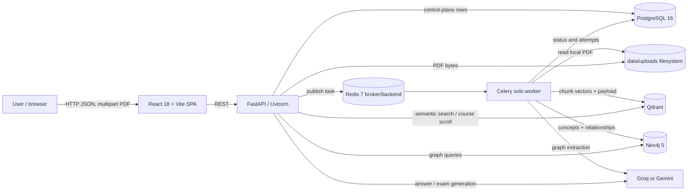
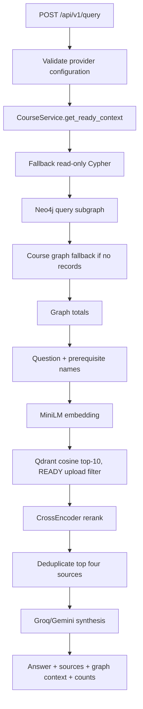
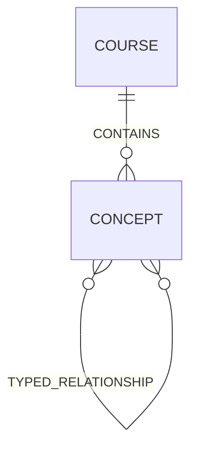
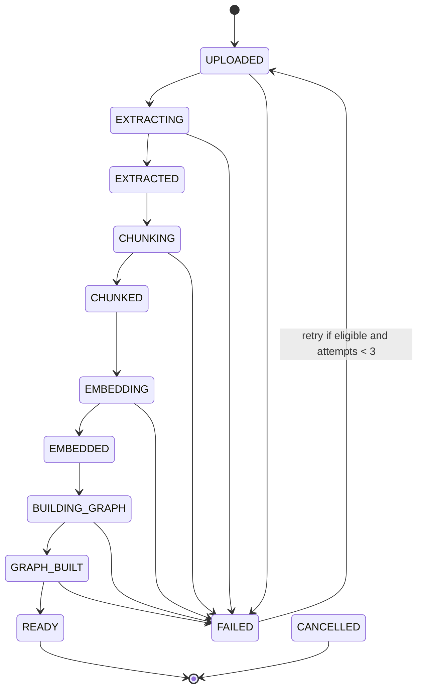

# ConceptGraph Engineering Handbook

> Evidence basis: the repository state shipped with this handbook, including the course-summary and graph-integrity changes. This handbook describes code that exists in this repository. Where intent, runtime behavior, or operational characteristics cannot be proven statically, the text says so explicitly. It does not treat README claims as implementation evidence.

## 1. Project Overview

ConceptGraph is a local-first academic document ingestion and retrieval application. A user assigns one or more PDFs to a named course, waits for asynchronous processing, asks questions grounded in those PDFs, generates multiple-choice practice exams, previews cited pages, and explores a query-related concept graph.

The system solves five connected problems:

1. Long PDFs cannot safely be parsed, embedded, and graph-extracted inside an interactive HTTP request.
2. Similar course names must resolve to one durable identity so retrieval does not silently fragment data.
3. Semantic retrieval alone does not express conceptual prerequisites; a graph can contribute related prerequisite names to the vector query.
4. Generated answers need document, page, heading, and passage provenance instead of internal vector identifiers.
5. Partial processing, retries, and duplicate uploads need durable, user-visible state.

### Target users

- Students querying course PDFs and generating revision exams.
- Instructors assembling a course corpus and inspecting extracted concepts.
- Developers evaluating a small GraphRAG pipeline locally.

There is no implemented user account, organization, role, or access-control model. The README calls course scoping “multi-tenant,” but the code implements logical course isolation, not tenant isolation or authorization.

### Functional requirements implemented

- Accept PDF uploads of at most 10 MiB.
- Reject non-PDF MIME types, malformed PDFs, empty PDFs, and password-protected PDFs.
- Normalize course names and assign deterministic UUIDv5 course IDs.
- Detect duplicate content per course with SHA-256.
- Process PDFs asynchronously with Celery and Redis.
- Extract page text with PyMuPDF and split it into overlapping chunks.
- Embed chunks with SentenceTransformers and store them in Qdrant.
- Ask Groq or Gemini to extract concepts and relationships, then store them in Neo4j.
- Gate query and exam operations on PostgreSQL documents in `READY` state with at least one processed chunk.
- Retrieve graph context, use prerequisite names to expand semantic search, cross-encode rerank results, synthesize an answer, and build citations.
- Generate exactly 1–20 structured multiple-choice questions from course chunks.
- Poll processing state, retry eligible failures, remove failed records, preview uploaded PDFs, and render graph data.

### Non-functional properties present in code

- Idempotent vector IDs derived from deterministic chunk IDs.
- Per-course PostgreSQL advisory locking during upload duplicate checks.
- Row locking for retry admission.
- Explicit processing stages and bounded retries.
- Compensating cleanup of Qdrant and Neo4j data after worker failure.
- Pydantic validation for graph extraction, exams, and HTTP payloads.
- Lazy frontend routes and graph/exam components.
- Local Apple Silicon support through ARM64 containers and MPS model execution.

### Current limitations

- No authentication, authorization, tenant boundary, rate limiting, CSRF protection, malware scanning, or audit log.
- Uploaded files are stored on one local filesystem, which prevents transparent horizontal API/worker scaling.
- SQL schema migration is handwritten at startup; there is no Alembic history or rollback.
- PostgreSQL uses `NullPool`, trading loop safety for connection churn.
- The worker has no configured Celery retry policy, hard/soft time limit, task acknowledgment policy, dead-letter queue, or distributed per-document execution lock.
- Qdrant collection creation is lazy and has no payload indexes, aliases, version field, or embedding-model compatibility check.
- Neo4j has no repository-defined constraints or indexes.
- Graph extraction samples at most eight excerpts of 700 characters, so the graph is intentionally incomplete relative to all chunks.
- Graph extraction is a single LLM call; large or broad documents may produce sparse coverage.
- Query graph retrieval always starts with the deterministic fallback Cypher. The implemented LLM Cypher generator is not invoked by `retrieve()`.
- Exam generation scrolls all matching chunks, then truncates prompt context to 24,000 characters; selection is storage order, not semantic or coverage-aware.
- Citation relevance is inferred from reranking; there is no entailment check connecting individual claims to sources.
- `source_id` is stable only within one response, not across requests.
- Tests cover a narrow set of pure rules and one mocked readiness case. There are no API, worker, database integration, frontend, load, security, or end-to-end tests in the repository.

## 2. System Architecture



### Component responsibilities

| Component | Why it exists | Concrete implementation |
| --- | --- | --- |
| React frontend | Interactive upload, query, queue, citations, exam, graph, and PDF preview | `src/App.tsx`, `src/pages/Dashboard.tsx`, `src/components/*` |
| FastAPI | Input validation, request orchestration, status APIs, file serving, lifecycle setup | `app/main.py`, `app/api/endpoints/*` |
| Celery worker | Keeps parsing, embedding, and graph extraction off the HTTP event loop | `app/tasks/document_tasks.py` |
| Redis | Celery broker and result backend | `REDIS_URL`, `docker-compose.yml` |
| PostgreSQL | Source of truth for courses, documents, attempts, stages, counts, and safe errors | SQLAlchemy models in `app/models/document_upload.py` |
| Filesystem | Stores original PDFs under UUID filenames | `data/uploads/{upload_id}.pdf` |
| Qdrant | Stores normalized dense vectors and chunk payloads for semantic/filter retrieval | `IngestionService.upsert_chunks_to_qdrant` |
| Neo4j | Stores Course and Concept nodes plus typed concept relationships | `IngestionService.store_graph_extraction` |
| SentenceTransformers | Local embedding and cross-encoder reranking | `all-MiniLM-L6-v2`; `cross-encoder/ms-marco-MiniLM-L-6-v2` |
| Groq/Gemini | Graph extraction, answer synthesis, and exam generation | provider branches in ingestion, synthesis, and exam services |

### Deployment topology

`docker-compose.yml` starts PostgreSQL, Redis, Qdrant, and Neo4j only. FastAPI, Celery, and Vite are started as host processes according to the README. All databases publish ports to the host and use bind-mounted data directories. No reverse proxy, TLS endpoint, container health check, orchestration manifest, production process supervisor, or cloud deployment configuration is implemented.

## 3. End-to-End Request Flows

### 3.1 Upload and processing

```mermaid
sequenceDiagram
    actor User
    participant UI as UploadModal
    participant API as upload_document
    participant PG as PostgreSQL
    participant Redis
    participant Worker as process_pdf_task
    participant PDF as ParserService
    participant Q as Qdrant
    participant LLM
    participant N as Neo4j

    User->>UI: choose PDF and course
    UI->>API: POST /api/v1/ingest/upload
    API->>API: validate extension, MIME, size, PDF structure
    API->>API: persist temporary UUID-named file and SHA-256 it
    API->>PG: advisory lock by normalized course name
    API->>PG: get/create Course; check course + hash duplicate
    alt duplicate exists
        API->>API: delete newly copied file
        API-->>UI: existing document, duplicate=true
    else new document
        API->>PG: insert DocumentUpload + ProcessingAttempt
        API->>Redis: process_pdf_task.apply_async
        API-->>UI: 202 UPLOADED
        Redis->>Worker: deliver task
        Worker->>PG: EXTRACTING
        Worker->>PDF: extract_pages
        Worker->>PG: EXTRACTED then CHUNKING
        Worker->>PDF: chunk_pages
        Worker->>PG: CHUNKED then EMBEDDING
        Worker->>Q: ensure collection and upsert vectors
        Worker->>PG: EMBEDDED then BUILDING_GRAPH
        Worker->>LLM: extract graph from sampled excerpts
        Worker->>N: merge course, concepts, edges
        Worker->>PG: GRAPH_BUILT then READY with counts
    end
```

Function chain:

`UploadModal.handleSubmit` → `uploadDocument` → `upload_document` → `_sha256_file` → `CourseService.get_or_create` / `resolve` → `UploadService.find_duplicate` → `UploadService.create_upload` → `process_pdf_task.apply_async` → `process_pdf_task` → `ParserService.extract_pages` → `ParserService.chunk_pages` → `IngestionService.upsert_chunks_to_qdrant` → `IngestionService.extract_graph_from_chunks` → `extract_graph_from_text` → provider-specific extraction → `store_graph_extraction` → `UploadService.mark_completed`.

Failure path: worker catches `LLMConfigurationError` or any `Exception`, classifies it with `classify_failure`, attempts `IngestionService.cleanup_upload`, writes a safe failure into both current document and current attempt, and returns a failed Celery result. Cleanup failure is logged and does not replace the original processing failure.

### 3.2 Status, history, retry, preview, deletion

- The dashboard loads `listUploads()` and `listCourses()` together on mount. The dedicated course summary endpoint prevents selector contents from depending on the truncated queue. `list_uploads` first calls `expire_stale_uploads`, marking active records older than 15 minutes as `WORKER_ERROR` failures and preserving the three-attempt retry cap.
- While any displayed job is active, a 2.5-second browser interval calls `GET /status/{task_id}` for each active task. When a task becomes terminal, the dashboard refreshes course summaries; a newly uploaded course is automatically selected when it becomes READY. A fresh dashboard session defaults to the most recently updated READY course.
- Retry calls `POST /uploads/{upload_id}/retry`. The service takes a PostgreSQL `FOR UPDATE` row lock and admits only `FAILED`, retryable records below three attempts. It updates the same document, creates a new `ProcessingAttempt`, and publishes a new task ID.
- Preview looks up the document row and streams the stored local PDF through `FileResponse`.
- Deletion permits only a failed database record, deletes it and cascaded attempts, then unlinks the PDF. It does not call Qdrant/Neo4j cleanup at deletion time; the worker is expected to have cleaned partial data.

### 3.3 Grounded query



`query_conceptgraph` validates LLM credentials before course lookup. `CourseService.get_ready_context` resolves either immutable course UUID or normalized name, then requires at least one document with `stage == READY` and `processed_chunk_count > 0`. Both query and exam use this same gate.

`RetrievalService.retrieve` calls `execute_graph_retrieval`. Despite the existence of `generate_cypher`, this path directly calls `_fallback_cypher`. It searches concept names using lowercased terms from the question, limits results to five, falls back to up to 50 course concepts if no term matches, and independently counts total nodes/edges. Incoming relationships supply prerequisite nodes and names. Those names are appended to the user question before embedding.

Qdrant semantic retrieval filters by `upload_id IN context.document_ids`, requests ten points by default, and returns text plus all payload metadata except the text field. `RerankService` scores every result with the cross-encoder. `build_sources` removes exact duplicate `(upload, page, passage prefix)` tuples and returns up to four source objects. `SynthesisService` passes only source number, document name, optional page/section, supporting passage, and graph names/descriptions to the LLM.

### 3.4 Practice exam

`ExamPanel.handleGenerate` → `generateExam` → `generate_exam` endpoint → `CourseService.get_ready_context` → `ExamService.generate_exam` → `_retrieve_chunks_by_metadata` → `_build_context` → `_generate_questions` → Groq/Gemini → `_parse_questions` → `ExamResponse`.

Unlike query retrieval, exam retrieval performs no semantic search. It scrolls every Qdrant point belonging to READY document IDs in batches of 100. `_build_context` includes at most six chunks and at most 24,000 characters. The exact ordering is Qdrant scroll order; no code ensures document diversity, page order, topic coverage, or highest relevance. The LLM must return exactly the requested count and four options per question; otherwise generation fails.

## 4. Data Flow and Storage Matrix

| Stage | Input | Output | Storage | Relevant function | Success | Failure |
| --- | --- | --- | --- | --- | --- | --- |
| Browser validation | File, course text | Accepted form | Browser memory | `UploadModal` handlers | `.pdf`, MIME, ≤10 MiB, non-empty course | Client error message |
| API upload validation | Multipart file | UUID-named PDF | Local `data/uploads` | `upload_document` | readable PDF with pages, no password | 400/413 and file removal |
| Course resolution | Display text | `Course` | PostgreSQL | `get_or_create`, `resolve` | deterministic ID or existing normalized row | 400 empty; race/DB error |
| Duplicate detection | Course UUID, SHA-256 | existing/new decision | PostgreSQL | `find_duplicate` | one existing record reused or new row | DB failure → 503 |
| Task creation | Document metadata | document + attempt | PostgreSQL/Redis | `create_upload`, `apply_async` | committed rows and broker publish | broker failure marks the saved document as retryable `WORKER_ERROR` and returns 503 |
| Extraction | PDF path | `(page, text)` list | worker memory | `extract_pages` | at least one textual page eventually yields chunks | missing, malformed, encrypted, scanned/empty |
| Chunking | Page text | `DocumentChunk[]` | worker memory | `chunk_pages` | ≥1 chunk | empty list → document error |
| Embedding | Chunk text | normalized vectors | model memory | `embedding_model.encode` | vector for each chunk | model/device/runtime error |
| Vector write | Vectors + payload | points | Qdrant | `upsert_chunks_to_qdrant` | upsert returns | service/schema error |
| Graph extraction | sampled chunks | validated nodes/edges | worker memory/LLM | `extract_graph_from_chunks` | Pydantic-valid JSON | config/provider/schema error |
| Graph write | graph extraction | Course/Concept/relations | Neo4j | `store_graph_extraction` | all awaited writes return | connectivity/query error |
| Ready commit | counts | `READY` row/attempt | PostgreSQL | `mark_completed` | final commit succeeds | DB error triggers catch and cleanup attempt |
| Query readiness | course name/UUID | ready IDs | PostgreSQL | `get_ready_context` | ≥1 READY document and count > 0 | 404 or 409 |
| Graph retrieval | question + ready IDs | subgraph and totals | Neo4j | `execute_graph_retrieval` | queries complete | endpoint maps broad retrieval errors to 503 |
| Vector retrieval | expanded query | top ten chunks | Qdrant | `search_qdrant` | points returned | missing collection → empty; other errors → 503 |
| Rerank | question + chunks | sorted chunks | process memory | `RerankService.rerank` | scores generated | 503 |
| Citation building | ranked chunks | max four sources | process memory | `build_sources` | non-empty passages | endpoint returns 404 if none |
| Synthesis | question, graph, sources | grounded answer | LLM | `SynthesisService.synthesize` | provider response | config/retrieval errors |
| Exam retrieval | ready IDs | all chunk payloads | Qdrant | `_retrieve_chunks_by_metadata` | ≥1 point | endpoint 409 if none |
| Exam generation | max six excerpts | validated MCQs | LLM/process memory | `_generate_questions`, `_parse_questions` | exact count, valid options | 500/503/400 according to endpoint branch |
| Dashboard | API responses | UI state | React memory only | `Dashboard` hooks | render/poll succeeds | local error panel/error boundary |

## 5. File-by-File Guide

### Backend entry and core

| File | Purpose and important symbols | Connections and decisions |
| --- | --- | --- |
| `app/main.py` | Creates FastAPI; `lifespan`; `/api/v1/health` | Runs schema initialization before serving; health checks PostgreSQL only; local-development CORS allowlist/regex; closes shared DB clients at shutdown. |
| `app/core/config.py` | `Settings`, `get_settings`, global `settings` | Loads `.env`; caches settings; constructs asyncpg DSN; defaults expose local development credentials, not production-safe values. |
| `app/core/database.py` | engines/clients, dependencies, migration, cleanup | Uses async SQLAlchemy + `NullPool`, global async Neo4j driver, synchronous Qdrant client; additive startup DDL; legacy row backfill; no migration version table. |
| `app/core/processing.py` | `ProcessingStage`, `FailureCategory`, normalization, classification | Shared lifecycle vocabulary, three-attempt cap, substring-based exception classification. |
| `app/core/exceptions.py` | `LLMConfigurationError` | Distinguishes absent provider credentials from other runtime errors. |
| `app/models/document_upload.py` | `Base`, `Course`, `DocumentUpload`, `ProcessingAttempt` | Entire relational domain model. No ORM relationships are declared; services query foreign keys directly. |

### Schemas

| File | Purpose and validation |
| --- | --- |
| `app/schemas/extraction.py` | Strict graph LLM output: non-empty strings, no extra fields, lists of `ConceptNode` and `ConceptRelationship`. It does not validate that relationship endpoints exist among returned nodes or restrict relationship vocabulary. |
| `app/schemas/exam.py` | Strict MCQ and exam output. Exactly four options; correct answer must equal one option; extra fields forbidden. It does not ensure unique options, unique questions, citation structure, difficulty, or answer balance. |
| `app/schemas/ingest.py` | Upload acknowledgment and durable status response contracts. |

### Services and worker

| File | Purpose and key behavior |
| --- | --- |
| `app/services/course_service.py` | Central course identity, readiness, and aggregate metrics service. `get_or_create`, `resolve`, `get_ready_context`, and `list_summaries` serve upload/query/exam/dashboard. UUIDv5 is derived from normalized text. |
| `app/services/upload_service.py` | PostgreSQL document lifecycle: create, lookup, list, stale expiry, retry, stage updates, completion/failure, deletion, attempt lookup. Commits each stage independently. |
| `app/services/parser_service.py` | PyMuPDF extraction and per-page LangChain chunking. Default chunk target is 500 whitespace-estimated tokens with overlap 50. Heading detection picks the first line between 3 and 120 characters. |
| `app/services/ingestion_service.py` | Embeddings, Qdrant collection/upsert, graph extraction, Neo4j writes, and compensating cleanup. `_safe_relationship_type` sanitizes dynamic Cypher relationship labels. |
| `app/services/rag_service.py` | Graph query, totals, vector search, query expansion, and an unused provider-specific Cypher generation capability. Qdrant calls are moved to a thread by `retrieve`; Neo4j uses async APIs. |
| `app/services/rerank_service.py` | Eagerly loads a `CrossEncoder` when service is first dependency-resolved; predicts scores and sorts descending. |
| `app/services/citation_service.py` | Builds up to four readable, deduplicated source objects. Internal point IDs are omitted, though `document_id` and `metadata.upload_id` are still sent to the frontend. |
| `app/services/synthesis_service.py` | Provider validation, prompt assembly, Groq/Gemini dispatch, weak-evidence fallback, and answer ID sanitization. |
| `app/services/exam_service.py` | Filter-only course chunk scrolling, bounded context assembly, provider dispatch, strict JSON parsing and exact-count enforcement. |
| `app/services/graph_service.py` | Empty placeholder (one line). It implements no behavior. |
| `app/tasks/document_tasks.py` | Celery application and synchronous task wrapper around one `asyncio.run`. Creates a task-local Neo4j driver; uses fresh SQLAlchemy sessions per stage. |

### API endpoints

| File | Routes |
| --- | --- |
| `app/api/endpoints/ingest.py` | Upload, status, list, retry, preview, and failed-record deletion. Creates `data/uploads` at import time. |
| `app/api/endpoints/query.py` | `POST /api/v1/query`; readiness → graph/vector retrieval → rerank → citation → synthesis. Cached service factories hold loaded models. |
| `app/api/endpoints/exam.py` | `POST /api/v1/exam/generate`; shared readiness → course-wide filtered retrieval → structured generation. |

### Frontend

| File | Purpose and key behavior |
| --- | --- |
| `src/main.tsx` | React root with `StrictMode`. |
| `src/App.tsx` | Tiny History API router for `/` and `/dashboard`; lazy routes; fixed navigation; application error boundary. There is no React Router dependency. |
| `src/pages/Home.tsx` | Landing-page composition using the animated hero and MacBook visualization. |
| `src/pages/Dashboard.tsx` | Main state/orchestration component: immutable-ID course selection from course summaries, pending-upload selection handoff, per-course and queue metrics, queue filters/polling/actions, answer/citations, graph transformation, PDF preview. Course changes clear stale answer and graph state. |
| `src/services/api.ts` | Typed frontend API contracts and `fetchWithTimeout`; defaults to `http://localhost:8000/api/v1`; parses FastAPI `detail`; query/exam timeout 60 s. |
| `src/components/UploadModal.tsx` | Client PDF/course validation, drag/drop, upload request, success/error state. |
| `src/components/ExamPanel.tsx` | Fixed five-question generation and reveal/hide answer state. |
| `src/components/ConceptGraphCanvas.tsx` | Cytoscape lifecycle, COSE layout, node details, fit control, and animated incoming-edge traversal. Uses one graph instance and replaces elements on data change. |
| `src/components/PdfPreviewModal.tsx` | Modal iframe and external-tab link for API-served PDF. |
| `src/components/AppErrorBoundary.tsx` | Catches render/lifecycle errors below it and offers reload; it does not catch event-handler or async request errors. |
| `src/components/ui/button.tsx` | Variant-based reusable button built on Radix Slot and class-variance-authority. |
| `src/components/ui/animated-hero.tsx` | Landing hero. |
| `src/components/ui/macbook-scroll.tsx` | Decorative animated laptop/dashboard presentation. |
| `src/lib/utils.ts` | `cn` class-name merge helper. |
| `src/index.css` | Tailwind layers and global styling. |

### Build, operations, and tests

| File | Purpose |
| --- | --- |
| `docker-compose.yml` | Four stateful local services, host ports, ARM64 platform, persistent bind mounts. |
| `requirements.txt` | Unpinned Python dependencies. Reproducibility is not guaranteed across fresh installs. |
| `package.json` / `package-lock.json` | Frontend scripts and locked npm dependency graph. |
| `vite.config.ts`, `tsconfig*.json`, `tailwind.config.ts`, `postcss.config.js` | Frontend build, type, path alias, Tailwind, and PostCSS configuration. |
| `tests/test_processing.py` | Six `unittest` assertions covering normalization, two failure classes, citation deduplication/ID omission, and empty ready context. |
| `scaffold.sh` | Repository scaffolding helper; not part of runtime. Its exact historical use cannot be proven. |

Package marker files such as `app/__init__.py`, `app/api/__init__.py`, and similar one-line files define Python packages but contain no domain behavior.

## 6. PostgreSQL Design

PostgreSQL is the authoritative control plane. Qdrant and Neo4j contain derived data. The code has no SQL table for extracted text or chunks; page text and chunks exist only in worker memory before Qdrant storage.

### `courses`

| Column | Type | Constraint / meaning |
| --- | --- | --- |
| `id` | `VARCHAR(64)` | Primary key; deterministic UUIDv5 string |
| `normalized_name` | `VARCHAR(255)` | Non-null, unique, indexed; trimmed, case-folded, internal whitespace collapsed |
| `display_name` | `VARCHAR(255)` | Non-null; input trimmed and uppercased at creation |
| `created_at` | timezone-aware timestamp | Non-null, server default `now()` |

`normalized_name` prevents `CYBER`, `Cyber`, `cyber`, and ` CYBER ` from becoming separate courses. `id` is immutable by convention, not by a database trigger. Deterministic UUIDv5 means two independent installations produce the same ID for the same normalized name, but renaming a course is not implemented.

Course summaries and READY retrieval additionally collapse historical rows sharing the same `(course, content_hash)` into one logical document. This is a read-time compatibility repair for duplicate rows created before SHA-256 admission existed; it does not delete historical records.

### `document_uploads`

| Column | Type | Constraint / meaning |
| --- | --- | --- |
| `upload_id` | `VARCHAR(64)` | Primary key, random UUIDv4 string |
| `task_id` | `VARCHAR(64)` | Unique and indexed; current attempt’s Celery task ID |
| `course_id` | `VARCHAR(255)` | Indexed legacy/display course name; despite its name, not canonical identity |
| `course_uuid` | `VARCHAR(64)` | Nullable FK to `courses.id`, indexed for legacy migration compatibility |
| `content_hash` | `VARCHAR(64)` | Nullable, indexed SHA-256 hex digest |
| `week_number` | integer | Non-null legacy column; every new upload stores `1`; not product-facing |
| `original_filename` | `VARCHAR(255)` | Client-provided filename |
| `stored_file_path` | text | Local relative path |
| `status` | `VARCHAR(32)` | Indexed coarse UI class: active/ready/failed/cancelled |
| `stage` | `VARCHAR(32)` | Indexed durable processing stage |
| `failure_category` | `VARCHAR(32)` | Nullable classification string |
| `retryable` | boolean | Whether current failure may be retried, additionally bounded by attempts |
| `attempt_count` | integer | Starts at one; max accepted value is three through service logic |
| `last_attempted_at` | timezone timestamp | Set at create/retry |
| `processed_chunk_count` | integer | Qdrant upsert count recorded at completion |
| `graph_node_count` | integer | LLM extraction node count, not a live Neo4j recount |
| `graph_edge_count` | integer | LLM extraction edge count, not a live Neo4j recount |
| `error_message` | text | Safe user-facing error |
| `result_json` | JSON | Completion summary (`chunks_indexed`, `nodes_upserted`, `relationships_upserted`) |
| `created_at`, `updated_at` | timezone timestamps | Server defaults; `updated_at` has SQLAlchemy `onupdate` behavior |
| `started_at`, `completed_at` | timezone timestamps | Lifecycle timestamps |

There is no database-level unique constraint on `(course_uuid, content_hash)`. The endpoint serializes same-course upload admission with `pg_advisory_xact_lock(hashtext(key))`, which closes the expected concurrent API race as long as every writer uses that endpoint and the transaction remains active. Direct writers or hash collisions in PostgreSQL’s 32-bit `hashtext` lock key are outside that guarantee. A composite unique index would provide a stronger invariant.

### `processing_attempts`

| Column | Type | Constraint / meaning |
| --- | --- | --- |
| `id` | `VARCHAR(64)` | Primary key UUIDv4 string |
| `document_id` | `VARCHAR(64)` | Non-null indexed FK to document, `ON DELETE CASCADE` |
| `task_id` | `VARCHAR(64)` | Non-null, unique, indexed |
| `attempt_number` | integer | Unique with `document_id` |
| `stage` | `VARCHAR(32)` | Latest stage reached by this attempt |
| `failure_category` | `VARCHAR(32)` | Nullable |
| `retryable` | boolean | Final retryability for failed attempt |
| `error_message` | text | Safe failure text |
| `started_at`, `completed_at`, `created_at` | timezone timestamps | Attempt timing |

The model defines `UniqueConstraint(document_id, attempt_number)` without an explicit name. There is no endpoint exposing this history; the dashboard sees only `DocumentUpload.attempt_count` and current status.

### Transactions and migration

`initialize_database_schema` creates `courses`, executes additive `ALTER TABLE ... ADD COLUMN IF NOT EXISTS` statements and indexes, calls `Base.metadata.create_all`, then migrates rows with null `course_uuid`. The whole startup operation runs in `postgres_engine.begin()`.

Legacy migration derives course IDs, inserts courses with `ON CONFLICT (normalized_name) DO NOTHING`, optionally hashes surviving files, reads counts from `result_json`, and maps legacy states:

- completed with chunks → `READY` / `ready`;
- queued or running → retryable `FAILED` / `WORKER_ERROR`;
- everything else → non-retryable `FAILED` / `UNKNOWN_ERROR`.

Uncertainty: if an `ON CONFLICT` course already exists with an ID different from the deterministic ID being assigned to a legacy document, the code does not query the winning row before assigning `course_uuid`. Under current deterministic creation logic they should match, but historical/manual data could violate that assumption.

## 7. Qdrant Vector Database

### Why it exists

Qdrant supplies approximate nearest-neighbor search and metadata filtering without placing vector operations in PostgreSQL. The repository does not contain a benchmark or architectural decision record proving why Qdrant was chosen over pgvector, Pinecone, Weaviate, Milvus, or Elasticsearch.

### Collection

- Name: `QDRANT_COLLECTION_NAME`, default `conceptgraph_chunks`.
- Creation: lazy in `IngestionService._ensure_qdrant_collection`.
- Distance: cosine.
- Vector size: inferred from the first encoded vector at first collection creation.
- Default embedding model: `all-MiniLM-L6-v2`, whose standard output dimension is 384. The code does not assert 384; runtime collection size is authoritative.
- Collection existence race: a 409 “already exists” response is accepted.
- No quantization, replication, sharding, optimizer, HNSW, WAL, on-disk payload, or consistency options are configured by application code.

### Point identity and payload

Point ID is UUIDv5 of chunk ID. Chunk ID is `{upload_id}:{page_number}:{chunk_index}`. A retry of the same document produces the same IDs and overwrites points rather than adding duplicates.

Payload fields are:

| Field | Origin | Use |
| --- | --- | --- |
| `text` | chunk page content | answer/exam context |
| `chunk_id` | deterministic parser ID | provenance/debugging |
| `chunk_index` | page-local index | ordering metadata |
| `document_id` | canonical course UUID (misleading name) | retained metadata; not current readiness filter |
| `upload_id` | document UUID | duplicate-safe cleanup and READY filtering |
| `document_name` | original filename | citations |
| `source_path` | local path | stored payload; not exposed in normal source object |
| `page_number` | one-based PDF page | citations/preview |
| `section_heading` | first plausible page line | citation label |

No payload indexes are created for `upload_id`; filtered searches may degrade as the collection grows. No `embedding_model`, `embedding_version`, content hash, creation timestamp, or schema version is stored. Changing the embedding model without recreating/re-embedding can cause vector-size errors or semantically incompatible vectors.

### Retrieval algorithms

- Query: encode the question plus unique prerequisite names, normalize, cosine ANN query, filter `upload_id` with `MatchAny`, limit 10.
- Exam: Qdrant `scroll`, filter the same READY upload IDs, batch 100, no vectors, no semantic ranking.
- Cleanup: filter delete on `upload_id`, wait for completion.

The code attempts compatibility with older Qdrant clients by falling back from `query_points` to `search`, and from newer `scroll` keyword shape to an older call. Missing collection returns an empty result; other failures propagate.

### Tradeoffs

Qdrant gives purpose-built ANN search and clean payload filtering, but adds a third database and distributed consistency problem. Given the current small relational schema and local deployment, pgvector could reduce operational complexity at the cost of coupling control-plane and retrieval load. Pinecone would remove local operations but add network, vendor, and cost dependencies. No repository evidence quantifies these alternatives.

## 8. Neo4j Graph Database

### Graph schema



`Course` properties: `id`, `name`, `updated_at`.

`Concept` properties: scoped `id`, LLM source ID, `name`, `type`, `description`, `course_id`, `upload_id`, `document_name`.

Concept ID format is `{course_uuid}:{upload_id}:{llm_concept_id}`. This intentionally prevents nodes from separate documents from being merged, even if they describe the same concept. Consequently, “same concept across documents” is duplicated rather than reconciled.

`(:Course)-[:CONTAINS]->(:Concept)` establishes course membership. Concept-to-concept relationship type is dynamically sanitized from LLM output. Relationship properties: original `relation_type`, `course_id`, `upload_id`, `document_name`. Supported labels are not constrained to a fixed enum; the prompt suggests `PREREQUISITE_OF`, `PART_OF`, `EXPLAINS`, or `RELATED_TO`.

Graph retrieval iterates native Neo4j `Record` values rather than calling `Result.data()`. In the installed driver, `data()` converts relationships into lossy tuples and removes the endpoint properties needed by `_relationship_to_dict`; preserving native records avoids the retrieval failure and retains type, direction, and provenance.

### Writes

`store_graph_extraction` performs one awaited `session.run` per course, node, and relationship. It does not use an explicit transaction or batch `UNWIND`. The driver’s auto-commit transactions mean a later failure can leave prior nodes committed. Worker cleanup compensates by deleting all concepts with the upload provenance.

Relationship creation matches both scoped endpoint IDs and course membership. If the LLM returns an edge whose endpoint node is absent, the `MATCH` produces no row and the edge is silently not created; the recorded `relationships_upserted` still counts the LLM response, not actual database edges.

No `CREATE CONSTRAINT` or `CREATE INDEX` statement exists in the repository. `MERGE` correctness under concurrent writes relies on scoped IDs and application behavior, but without a uniqueness constraint concurrent writes can theoretically create duplicates.

### Reads

The query-specific fallback:

- scopes course IDs and READY upload IDs;
- tokenizes up to 12 terms from the question;
- matches term substrings against lowercased concept names;
- optionally matches any incoming relationship to the concept;
- returns at most five concepts.

If no records match, `_fetch_course_graph` returns up to 50 concepts ordered by name with incoming relationships. `_fetch_graph_totals` counts course concepts and outgoing relationships for READY document IDs. Relationship direction in API output is hardcoded as `outgoing` based on Neo4j start/end nodes.

Earlier behavior treated every incoming relationship as a “prerequisite” for query expansion regardless of type, allowing `PART_OF`, `RELATED_TO`, and arbitrary edges to add noise.

Current behavior after the graph-integrity audit: only incoming `PREREQUISITE_OF` edges contribute names to semantic query expansion. Other typed relationships remain available for display but are not mislabeled as prerequisites. The frontend’s highlighted dependency traversal applies the same relationship-type rule.

### Display counts

Backend metadata returns total nodes/edges separately from displayed query nodes/edges. Both backend metadata and frontend `buildGraphElements` deduplicate edges by `(source, target, type)`. The frontend discards an edge if either endpoint is absent from the response node set. New graph extraction validation rejects missing endpoints and duplicate concept IDs before persistence and collapses repeated identical edges.

## 9. Embeddings, Chunking, and Reranking

### Chunking

Each non-empty PDF page is split independently with `RecursiveCharacterTextSplitter`. The target size is 500 words, not tokenizer-accurate model tokens, because `_estimate_token_count` returns `len(text.split())`. Overlap is 50 words. Separators prefer paragraphs, lines, sentence-like `. ` boundaries, spaces, then characters.

Page-local chunking preserves exact page provenance but cannot create a chunk spanning a page break. Headings are heuristically the first nontrivial line of each page; headers, university names, or page furniture can be mislabeled as sections.

### Bi-encoder

The default `all-MiniLM-L6-v2` is loaded lazily once per `IngestionService` or `RetrievalService` instance and runs on MPS if available, otherwise CPU. Inputs and output vectors are normalized. The code does not select CUDA even if available. Model download/cache behavior is delegated to SentenceTransformers and is not configured in the repository.

The standard model is small and fast compared with larger embedding models, but its semantic quality and context length are lower. The code contains no benchmark establishing why it was selected. Alternatives include larger SentenceTransformers models, BGE/E5 families, provider embeddings, or domain-fine-tuned models.

### Cross-encoder

`cross-encoder/ms-marco-MiniLM-L-6-v2` scores the ten bi-encoder candidates as `(question, passage)` pairs. Cross-encoders usually improve ranking precision because they jointly encode query and text, but cost one inference per pair and cannot efficiently search the whole corpus. Here the candidate count bounds that cost.

No rerank score threshold is applied. Even weak results can become sources. The weak-evidence fallback is only used when no sources exist, not when scores are low.

## 10. Processing Lifecycle and Consistency



`CANCELLED` exists in enums and UI types, but no service transition or cancellation endpoint sets it.

Each `set_stage` opens a fresh async session in the worker and commits independently. This gives durable progress visibility but not one atomic distributed transaction. READY is committed only after vector write, graph write, and count assembly have returned. There is no two-phase commit across PostgreSQL, Qdrant, and Neo4j. Correctness is achieved through readiness gating, deterministic IDs, and best-effort compensation.

Important windows:

- PostgreSQL document/attempt commit can succeed before Redis task publication fails. The endpoint catches publication failure, marks the saved document as retryable `WORKER_ERROR`, and returns a 503 explaining that it can be retried. A transactional outbox is still needed to eliminate ambiguous broker acknowledgements and process crashes inside this window.
- Qdrant upsert can succeed and PostgreSQL `EMBEDDED` commit can fail. The broad worker catch attempts vector/graph cleanup.
- Some Neo4j auto-commit writes can succeed before a later edge fails. Cleanup deletes all provenance-scoped concepts.
- Cleanup itself can fail. The row is still marked failed if PostgreSQL is available, but orphaned vectors/graph nodes may remain. READY filters protect query retrieval from vectors because failed upload IDs are excluded; Neo4j queries are also filtered by READY document IDs.
- If PostgreSQL is the failing dependency, marking failure can itself raise from inside the exception handler; no outer recovery catches that second failure.

## 11. API Reference

All routes are unauthenticated. FastAPI automatically returns 422 for Pydantic or multipart validation errors not explicitly handled.

### `GET /api/v1/health`

Checks `SELECT 1` against PostgreSQL. Returns `200 {"status":"healthy"}` or `503 {"detail":"Database is unavailable."}`. It does not check Redis, Celery workers, Qdrant, Neo4j, model availability, filesystem writeability, or LLM credentials.

### `POST /api/v1/ingest/upload`

Multipart request: `course_id: string`, `file: PDF`. Returns 202 `IngestResponse`: message, current task/document IDs, canonical course ID, display name, filename, status, duplicate flag, preview URL. A duplicate also returns 202 because the route decorator fixes the status; it references the existing task and document.

Errors: 400 extension/MIME/empty course/password/empty/malformed PDF; 413 >10 MiB; 503 database tracking or worker-publication failure. On publication failure, the file and document are retained as a retryable failure. Complexity includes O(file size) copy and hash plus PDF structural open; expensive text processing remains asynchronous.

### `GET /api/v1/ingest/status/{task_id}`

Returns current document state by its current task ID. Old retry task IDs no longer resolve because `DocumentUpload.task_id` is overwritten, despite attempts retaining old task IDs. Returns 404 if not current/found.

### `GET /api/v1/ingest/uploads?limit=25`

Expires stale rows, fetches the latest 100, groups by `(course identity, content hash)`, prefers active over ready over failed over cancelled, and truncates the result to 1–100. Query parameter values below one still return one item; values over 100 cap at 100. No Pydantic bounds declaration exists.

### `GET /api/v1/ingest/courses`

Returns every canonical course independently of upload-list truncation. Each item contains immutable course ID, display name, total/active/READY/failed document counts, aggregate processed chunks, graph nodes, graph edges, and last update time. The dashboard uses these records for readable selector labels and selected-course metrics; courses without READY documents remain visible but cannot be selected for query or exam generation.

### `POST /api/v1/ingest/uploads/{upload_id}/retry`

Returns `IngestResponse` for a new attempt on the same document. Errors: 404 missing record or missing stored PDF; 409 wrong state, permanent failure, concurrent winner, or max attempts. Missing-file failure is recorded with default `UNKNOWN_ERROR`, non-retryable, rather than explicit `DOCUMENT_ERROR` because this endpoint calls `mark_failed` directly without `classify_failure`.

### `GET /api/v1/ingest/uploads/{upload_id}/preview`

Streams the original file as `application/pdf` with original filename. Errors: 404 missing row/file. There is no authorization check or page-range endpoint.

### `DELETE /api/v1/ingest/uploads/{upload_id}`

Returns 204 for a failed record and removes its file. Returns 409 for missing or non-failed records; missing conventionally could be 404, but that is not implemented.

### `POST /api/v1/query`

Request: `{question: non-empty string, course_id: non-empty name-or-UUID}`. Response: `{answer, sources, graph_context, graph_metadata}`.

Errors: 404 unknown course or no source passages; 409 no READY documents or READY records with missing vectors; 503 provider configuration, graph/vector retrieval, reranking, or synthesis failures. Timeout is enforced only by the frontend at 60 seconds, not server-side.

### `POST /api/v1/exam/generate`

Request: `{course_id, num_questions=5}` with count 1–20. Response: canonical course UUID, validated questions, and `source_count` (number of context chunks capped at six, not citations). Errors: 404 course absent; 409 no READY documents or no vectors; 503 missing provider; 400 service `ValueError`; 500 other generation/provider/schema failures. Provider transient errors are mapped differently from query (500 versus query’s 503), which is a contract inconsistency.

## 12. Background Worker Semantics

Celery uses Redis for both broker and result backend. The documented local command uses `--pool=solo --concurrency=1`; this serializes all PDFs in one worker process. Application code does not configure serializer, task routes, prefetch, result expiry, acknowledgment behavior, retries, time limits, heartbeat behavior, or visibility timeout.

The task catches errors and returns a normal `{"status":"failed"}` result instead of raising. Celery therefore considers the task execution successful at the transport level, while PostgreSQL represents domain failure. This avoids automatic broker retries but makes Celery monitoring alone misleading.

Retry is application-controlled through the HTTP endpoint. It is not Celery `self.retry`. Row locking prevents two HTTP retry requests from both updating the record. There is no execution-time lock preventing an old delayed task and a new retry task from processing the same document concurrently. Deterministic Qdrant IDs reduce duplicate vectors, but concurrent Neo4j operations and competing PostgreSQL stage updates remain possible.

## 13. Failure Handling

| Category | Detection | Retry | Safe action/message |
| --- | --- | --- | --- |
| `CONFIGURATION_ERROR` | message mentions API key, not configured, 401 | no | administrator updates provider config |
| `DOCUMENT_ERROR` | password/encrypted/malformed/no text, or missing PDF/file | no | upload readable non-encrypted PDF / upload again |
| `TIMEOUT_ERROR` | timeout, 429, rate-limit, temporary busy | yes | retry in a minute |
| `DATABASE_ERROR` | database/Postgres/Qdrant/Neo4j/connection text | yes | retry after storage recovers |
| `WORKER_ERROR` | different loop, worker, interrupted | yes | retry |
| `PROVIDER_ERROR` | provider/Groq/Gemini/503 | yes | retry |
| `UNKNOWN_ERROR` | default | no | inspect server logs |

Classification is string matching, order-dependent, and locale/message dependent. For example, any exception containing “connection” becomes a database error even if it is an LLM HTTP connection. A provider 401 is correctly treated as permanent configuration. There is no structured exception hierarchy for document, provider, or storage errors beyond `LLMConfigurationError`.

Maximum attempts are three total, including the original. `mark_failed` clears retryability at the cap. The frontend renders Retry only when the response says retryable (verified in dashboard code). Stale active rows are reclassified when the uploads list endpoint is called, not by a scheduler.

## 14. Security Review

### Existing controls

- Extension and MIME allowlist, 10 MiB check before and after copy, PyMuPDF structural open, password/page checks.
- Server-selected UUID filenames prevent path traversal through `original_filename`.
- Pydantic strips and bounds request strings/counts.
- Generated Cypher validator rejects a list of write keywords and requires expected variable names.
- Fallback Cypher uses parameters and does not interpolate user text.
- Graph relationship labels are sanitized before dynamic Cypher interpolation.
- Answer prompts exclude raw vector IDs and source paths.
- LLM keys come from environment-backed settings and are not returned by API code.
- CORS is limited to local development hostnames/ports.

### Material gaps

- Anyone with network access can upload, query, preview, retry, and delete failed records for every course.
- Database ports are host-published with default development credentials.
- No TLS or encrypted database connection configuration is present.
- PDF parsing is performed on untrusted input without process/container sandboxing, malware scanning, decompression-bomb protection beyond byte size, or CPU/page-count limits.
- Stored PDFs and Qdrant payload source paths are unencrypted.
- Prompt injection in PDF text is not isolated. System prompts say to stay grounded, but document content can contain adversarial instructions.
- LLM-generated Cypher is implemented. Although the active retrieval path does not use it, `_validate_read_only_cypher` is a keyword denylist, not a full parser. Read-only resource-exhaustion queries are possible if this path is activated.
- No request rate limits, per-course quotas, upload quotas, LLM token budgets, or abuse detection.
- Broad local CORS regex allows any port on localhost-like hosts; appropriate for development, not deployment.
- Errors are logged with exception traces. Whether logs leak provider payload details depends on third-party exception strings and logging configuration, which is not defined in the repository.

## 15. Performance and Scalability

| Component | Current bottleneck / limit | Scale path |
| --- | --- | --- |
| Frontend | Polls every active item every 2.5 s; one large dashboard component; graph COSE layout on main thread | SSE/WebSocket aggregate status, pagination, virtualized lists, graph worker/layout limits |
| API | Sync Qdrant client requires thread offload in query/exam; no server timeouts; model initialization can stall first request | async Qdrant client, model warmup, multiple Uvicorn workers, explicit deadlines |
| PostgreSQL | `NullPool` opens connections frequently; list fetches 100 then groups in Python | bounded async pool per process/loop, SQL grouping/pagination, composite indexes/constraints |
| Filesystem | one host’s disk, orphan risk, no quota | object storage with content-addressed keys and signed access |
| Celery | documented single solo worker; one PDF at a time; heavyweight models per worker | dedicated queues/stages, multiple workers, model-serving process, GPU batch embedding |
| Embedding | all chunks encoded in one call; memory scales with document chunk count | bounded batches, backpressure, model server, GPU/CUDA support |
| Qdrant | no payload index; one collection; no model version | index `upload_id`, shard/replicate, collection alias by embedding version, batch APIs |
| Graph extraction | one provider call over ≤8 short excerpts; rate limits and sparse coverage | hierarchical extraction, bounded concurrent batches, merge/reconciliation, provider quotas |
| Neo4j write | O(nodes + edges) network round trips and no indexes | constraints, indexes, explicit transaction, `UNWIND` batched writes |
| Neo4j read | substring scan on names; up to 50 fallback concepts | full-text index, precomputed graph search fields, query plans, bounded traversals |
| Reranker | CPU/MPS cross-encoder per request, no batching/cache | shared inference service, batching, candidate/score thresholds, query cache |
| Exam | scrolls every course chunk even though only six are used | reservoir/coverage sampling, metadata ordering, semantic/topic selection, server-side cap |
| LLM | dominant latency, external rate limits, 60 s browser timeout | provider timeout/retry/circuit breaker, streaming, caching, smaller prompts |

At 100,000 PDFs, the current design breaks operationally before raw database capacity: local disk is not shared; a solo worker creates an enormous queue; course-wide exam scroll is unbounded; missing Qdrant/Neo4j indexes increase latency; no tenant quotas exist; models are replicated per process; and one collection/schema has no embedding-version migration story.

Memory worst cases include loading all page chunks for one PDF, encoding them as one batch, collecting all course chunks for an exam, and rendering a large graph. API graph reads are capped at 50 concepts, but total counting still traverses the scoped graph.

## 16. Technology Tradeoffs

| Decision | Why it fits current implementation | Cost / alternative |
| --- | --- | --- |
| FastAPI vs Express | Native Pydantic validation, async Python ecosystem, direct ML library use | Python process/model memory; Express would unify frontend language but require ML services |
| React/Vite vs Next.js | Small client-only dashboard, fast local build, no SSR requirement | custom router and no server rendering; Next adds deployment/runtime complexity not currently needed |
| PostgreSQL vs MongoDB | Strong uniqueness/FKs/row locks/advisory locks for lifecycle data | JSON flexibility is less central; MongoDB transactions/constraints would be less natural here |
| Qdrant vs pgvector | Dedicated ANN and payload APIs | Extra database and consistency surface; pgvector would simplify operations for current scale |
| Qdrant vs Pinecone | Fully local, no hosted dependency | Must operate it; Pinecone trades control for managed service/cost |
| Neo4j vs NetworkX | Persistent multi-request graph and Cypher traversal | Additional service; NetworkX is simple but in-memory/single-process and unsuitable as shared durable state |
| Neo4j vs relational edges | Natural typed traversal and graph inspection | PostgreSQL edge tables could reduce infrastructure and may suffice for shallow two-hop queries |
| Celery vs synchronous | Upload response is not blocked by model/provider work | Redis, worker operations, distributed state and compensation |
| UUID vs auto-increment | Safe IDs across processes; opaque URLs; deterministic course identity | Larger indexes and less human readability |
| Local MiniLM vs provider embedding | Privacy, no per-token API cost, offline-ish retrieval | model download/CPU memory, weaker quality than larger models, version management |
| Cross-encoder vs vector score only | Better precision on a small candidate set | extra inference latency and model memory |
| Distributed stores vs single database | Specialized retrieval and graph capabilities | no atomic transaction across all stores |

## 17. Major Design Decisions

| Problem | Alternatives | Chosen implementation | Pros | Cons / future |
| --- | --- | --- | --- | --- |
| Course identity drift | raw string, random ID, slug | normalized unique name + UUIDv5 | case/space stability, deterministic | no rename/alias workflow; add explicit course CRUD |
| Duplicate uploads | filename, size, hash | SHA-256 within course | content-based, filename independent | DB invariant not unique; add composite unique constraint |
| Processing visibility | one queued/completed flag | explicit stage + coarse status | debuggable and user-visible | transitions not validated as a state machine |
| Retry history | new document per retry | same document + attempt rows | no duplicate logical docs, preserves attempts | history API absent; old task status lookup absent |
| Partial writes | global transaction impossible | deterministic IDs + compensation + READY gating | practical across stores | cleanup is best effort; add reconciliation/outbox |
| Graph node identity | concept-name merge | per-course/per-upload scoped ID | provenance and cleanup are easy | no cross-document entity resolution |
| Graph coverage | call per chunk | one call over sampled excerpts | controls rate limit/cost | incomplete graph; hierarchical extraction is next step |
| Query graph generation | LLM Cypher | deterministic fallback in active path | safer and predictable | implemented generation is dead path; remove or test/activate deliberately |
| Citations | raw chunk cards | deduped source schema and LLM source numbering | readable and page-aware | no claim-level verification or persistent IDs |
| Exam context | semantic top-k | filtered scroll + first bounded excerpts | broad course filter, simple | arbitrary coverage and unbounded read |

## 18. Bottlenecks and Worst Cases

- A text-heavy 10 MiB PDF may create many chunks; one embedding batch can exhaust memory.
- A scanned PDF passes structural upload validation but produces no text and permanently fails; OCR is absent.
- A provider can return semantically weak but structurally valid concepts or relationships. Missing endpoints and duplicate entity IDs are now rejected, but factual correctness still requires evidence-aware evaluation.
- Redis is down after PostgreSQL commit; the endpoint records a retryable worker failure and returns 503. A process crash or ambiguous publish acknowledgement can still require reconciliation.
- Worker dies without executing exception handling; status remains active until a user calls the list endpoint after 15 minutes.
- Qdrant is down during cleanup; failed vectors may remain, though READY filtering prevents normal retrieval.
- Neo4j is down during query; the entire query fails even though Qdrant could answer. There is no vector-only degradation path.
- Cross-encoder model download/initialization fails on first query; the endpoint returns ranking unavailable.
- LLM returns fewer exam questions than requested; the whole exam fails rather than returning partial validated questions.
- A course with millions of chunks causes exam scroll to read all points before using six.
- Hundreds of active uploads cause browser polling fan-out and frequent PostgreSQL queries.
- Changing `EMBEDDING_MODEL_NAME` can make query vector dimensions incompatible with the existing collection.

## 19. Roadmap Ranked by Impact

1. Add integration tests using real PostgreSQL/Qdrant/Neo4j/Redis and a fake deterministic LLM; cover upload through READY, query, exam, retry, duplicate race, and cleanup.
2. Add authentication, authorization, ownership on courses/documents, and production secret/network configuration.
3. Replace startup DDL with Alembic; add `(course_uuid, content_hash)` uniqueness, state/count checks, and Neo4j/Qdrant indexes.
4. Add an outbox/reconciliation process for broker publication and cross-store orphan detection.
5. Put PDFs in shared object storage and add quotas, page/CPU limits, malware scanning, and OCR workflow.
6. Add structured exception types, provider/storage timeouts, circuit breakers, and consistent API error taxonomy.
7. Redesign exam context selection to bounded, diverse topic/page coverage without scrolling an entire course.
8. Version embedding collections and payload schemas; provide explicit re-embedding migration.
9. Batch Neo4j writes in explicit transactions and validate edge endpoints before counting.
10. Expose attempt history and aggregate status streaming; add true cancellation and worker leases.
11. Add graph entity resolution across documents and relationship-type-aware traversal. This changes GraphRAG behavior and should follow correctness baselines.
12. Add claim-level citation/entailment verification and calibrated weak-evidence thresholds.

## 20. Improvement Difficulty

### Easy

- Pin Python dependencies and add a lock file.
- Add API bounds to upload `limit`.
- Make exam/query provider errors consistent.
- Add Qdrant payload index for `upload_id`.
- Add supporting passage/page provenance and confidence evidence to graph relationships.
- Add score threshold and explicit weak-evidence response.
- Expose processing attempts read-only.
- Add Redis/Qdrant/Neo4j checks to a separate readiness endpoint.

### Medium

- Alembic migrations and composite uniqueness.
- Bounded batch embedding and exam retrieval.
- SSE status updates and server-side pagination.
- Structured error hierarchy and provider retries with jitter.
- Neo4j constraints, indexes, batched transactions.
- Shared object storage and signed preview URLs.
- Deterministic fake-provider integration test suite.

### Hard

- Transactional outbox plus cross-store reconciler.
- Horizontally scalable worker topology with execution leases and cancellation.
- Embedding version migration with dual-read/dual-write or collection aliases.
- Secure multi-tenant authorization and data deletion across all stores.
- High-quality course-wide coverage selection for exams and graph extraction.

### Research-level

- Cross-document concept entity resolution without collapsing distinct meanings.
- Calibrated GraphRAG contribution measurement against vector-only baselines.
- Claim-level citation entailment and uncertainty calibration.
- Adaptive chunking for layout, discourse structure, and multimodal PDFs.
- Graph extraction evaluation with typed-edge precision/recall and provenance confidence.

## 21. Technical Interview Questions and Model Answers

These answers defend the implementation honestly. A strong interview answer should separate what the system does today from what should change at larger scale.

### Architecture and distributed systems

1. **What is the source of truth?** PostgreSQL is authoritative for course identity, document readiness, retryability, attempts, and output counts. Qdrant and Neo4j are derived indexes. The original PDF on local disk is the recoverable source artifact, but the system currently lacks an automated rebuild command.

2. **Why use three databases?** PostgreSQL supplies transactions and constraints for workflow state, Qdrant supplies vector ANN and payload filtering, and Neo4j supplies typed graph traversal. This demonstrates specialized stores but creates distributed consistency cost; at current scale, PostgreSQL plus pgvector and relational edges would be a credible simplification.

3. **Is processing atomic?** Not globally. PostgreSQL, Qdrant, and Neo4j do not share a transaction. The system uses stage commits, deterministic vector IDs, provenance-scoped graph IDs, READY gating, and compensating cleanup.

4. **What exactly does READY guarantee?** The worker successfully extracted text, produced at least one chunk, upserted vectors, completed graph extraction/writes, recorded graph stage, and committed result counts. It does not continuously verify that derived data still exists after READY.

5. **Why is PostgreSQL checked before Qdrant retrieval?** It prevents failed or partial document IDs from entering filters. Orphaned vectors remain invisible because only READY upload IDs are searched.

6. **What happens if the API crashes after the document commit but before task publish?** An active row and file remain without a task. After 15 minutes, the next uploads-list request marks it a retryable worker failure. A transactional outbox would close this gap.

7. **What happens if a worker dies halfway?** No catch runs, so partial data may remain and state stays active. Dashboard list access eventually expires the row. Derived data is filtered out by readiness, but cleanup is not automatic after hard death.

8. **Why Celery?** PDF parsing, embedding, graph extraction, and external LLM calls are long-running and should not occupy an HTTP request. Celery gives brokered work and separate resource management, at the cost of Redis and distributed lifecycle complexity.

9. **Why is the documented worker single-concurrency?** `--pool=solo --concurrency=1` avoids macOS/PyTorch fork and async-loop issues and makes local execution reliable. It is not a scalable production topology.

10. **How would horizontal worker scaling work?** Shared object storage must replace local files; workers need a per-document execution lease; models should be warmed or served centrally; queues can separate parsing, embedding, graph extraction, and providers; all writes remain idempotent.

11. **What idempotency exists?** Course IDs are deterministic, duplicate files are SHA-256 checked per course, chunk IDs and Qdrant point IDs are deterministic, graph concept IDs include course/upload/source ID, and retry reuses the document. Broker publication itself has no outbox idempotency.

12. **Can duplicate uploads race?** The endpoint takes a PostgreSQL advisory transaction lock keyed by normalized course before get/create and duplicate lookup. This serializes endpoint writers per course, but a database unique constraint is still the stronger final invariant.

13. **Can retries race?** `retry_upload` uses `SELECT ... FOR UPDATE`; the first transaction changes FAILED to UPLOADED, so a second request fails admission. Old and new Celery tasks can still overlap because there is no execution lease.

14. **How are stale jobs detected?** `expire_stale_uploads` marks active rows older than 15 minutes failed when the list endpoint is called. This is demand-driven, not a scheduler or heartbeat.

15. **Why not mark jobs failed from Celery backend state?** The implementation treats PostgreSQL as domain truth and does not reconcile Celery state. Celery task exceptions are swallowed into domain failure results, so backend state alone would be insufficient.

16. **What is the CAP tradeoff?** There is no formal replicated cross-service protocol, but behavior favors availability of independent writes plus eventual compensation over cross-store atomic consistency. Query availability is low when Neo4j fails because there is no vector-only fallback.

17. **Where is backpressure?** Only the broker queue and single worker implicitly provide it. There are no queue limits, admission quotas, per-course limits, or provider concurrency controls.

18. **How would you make job processing exactly once?** End-to-end exactly-once is unrealistic across these stores. Use at-least-once delivery, execution leases/fencing tokens, deterministic IDs, transactional outbox, idempotent upserts, and reconciliation.

19. **How do you recover a derived store?** Conceptually replay READY source PDFs, but no rebuild endpoint/CLI exists. A production design would version derived artifacts and provide resumable reindex jobs.

20. **What observability exists?** Python logging around retrieval, exam, and worker failures plus persisted stages/counts. The dashboard now exposes active/READY/failed queue counts and per-course document/chunk/node/edge aggregates. There are no exported time-series metrics, traces, correlation IDs beyond task/upload IDs, SLOs, or alerts.

### Backend, FastAPI, and PostgreSQL

21. **Why FastAPI?** It offers async request handling, Pydantic contracts, dependency injection, generated OpenAPI, and direct access to Python ML libraries. The repository uses all except custom OpenAPI work.

22. **How are dependencies managed per request?** `get_postgres_session` yields one async SQLAlchemy session. Query services are process-cached with `lru_cache`; model objects and clients are reused.

23. **Why is Qdrant sync in an async API?** The configured `QdrantClient` is synchronous. Query and exam use `asyncio.to_thread` around blocking retrieval; ingestion runs in a worker. Moving to the async client would simplify thread behavior.

24. **Why `NullPool`?** The comment documents Celery solo tasks creating fresh asyncio loops; pooled asyncpg connections tied to old loops caused failures. NullPool fixes loop affinity by opening fresh connections but increases connection setup cost.

25. **How is course normalization implemented?** Trim, Unicode `casefold`, split on whitespace, and join with single spaces. Display name is trimmed and uppercased only at initial creation.

26. **Why UUIDv5 for courses?** Identity is deterministic from normalized name and stable across concurrent attempts/installations. The tradeoff is that changing a course’s canonical name has identity implications and no rename flow exists.

27. **What indexes exist?** ORM indexes on course normalized name, task ID, course name/UUID, content hash, status/stage, attempt document/task IDs; startup also explicitly creates course UUID/hash/stage indexes if absent. There is no composite duplicate index.

28. **What does the readiness SQL filter enforce?** Canonical `course_uuid`, `stage == READY`, and `processed_chunk_count > 0`. It does not check `status`, file existence, Qdrant count, or graph availability live.

29. **Why are both status and stage stored?** Stage is detailed workflow progress; status is coarse queue grouping. They can drift because the database has no consistency constraint, so one enum/state column plus derived grouping could be safer.

30. **How are updates made atomic?** Each stage and attempt update is committed together in one PostgreSQL transaction. The corresponding external store write occurs before the next stage commit and is not atomic with it.

31. **What migration strategy is used?** Idempotent startup DDL plus a legacy backfill. It is convenient locally but lacks ordered versions, rollback, reviewable migration history, and safe large-table operational controls.

32. **How are API errors shaped?** FastAPI `HTTPException.detail`, parsed by the frontend. There is no structured error code, retry-after, field taxonomy, or correlation ID.

33. **Why does health only check PostgreSQL?** That is what code implements; it is closer to a liveness/control-plane check than full readiness. Production should separate liveness from dependency readiness.

34. **How does file upload avoid path traversal?** The stored filename is server-generated from UUID. Original filename is metadata and response filename only.

35. **Does the 10 MiB limit fully protect parsing?** No. It bounds input bytes, but a small compressed PDF can have many pages or expensive structures. Page count, parse time, decompressed objects, and CPU need limits/sandboxing.

36. **What does deletion remove?** Failed PostgreSQL document and cascaded attempts, then local PDF. It does not explicitly remove vector/graph data at deletion time.

37. **Why overwrite `task_id` on retry?** It makes document status point to the current attempt and simplifies polling. The cost is that old `/status/{task_id}` lookups fail despite attempt history retaining those IDs.

38. **How is max retry enforced?** Both retry admission checks `attempt_count >= 3`, and failure marking only sets retryable below the cap.

39. **What is wrong with substring failure classification?** It can misclassify unrelated errors, depends on third-party wording, and loses structured metadata. Typed exceptions and explicit adapters are more robust.

40. **How would you test transaction races?** Use real PostgreSQL and concurrent requests for same course/hash and retry; assert one document/attempt transition, one broker outbox event, and no duplicate derived IDs.

### Retrieval, GraphRAG, embeddings, and LLMs

41. **Describe the GraphRAG algorithm actually used.** Deterministic term-based Neo4j lookup finds concepts and incoming related nodes; their names expand the semantic query; MiniLM retrieves ten READY-filtered chunks; a cross-encoder reranks; top deduped passages feed grounded synthesis.

42. **Does the query use LLM-generated Cypher?** No. `generate_cypher` exists, but `execute_graph_retrieval` directly uses `_fallback_cypher`. Claiming active text-to-Cypher would be inaccurate.

43. **How are query terms selected?** Regex extracts alphanumeric/underscore/plus/minus tokens starting with a letter, length at least three, lowercases them, and keeps twelve. There is no stop-word removal or stemming.

44. **What happens when no concept name matches?** The service fetches up to 50 course concepts ordered by name and includes their incoming relationships.

45. **What is “prerequisite” in code?** Every incoming neighboring concept, irrespective of relationship type. This is semantically broader than true prerequisites and should become type-aware.

46. **Why expand the vector query?** Graph names can add vocabulary and dependencies absent from the literal question, increasing recall for related course passages. It can also add noise when graph edges are weak.

47. **Why normalized embeddings and cosine distance?** Normalization makes dot-product geometry align with cosine similarity and removes magnitude. Qdrant is explicitly configured for cosine.

48. **What is top-k?** Ten vector candidates by default, then all ten are cross-encoded. Citation output keeps up to four deduplicated sources.

49. **How is the embedding dimension determined?** At first collection creation from `len(embeddings[0])`. Default MiniLM conventionally returns 384, but the code does not hardcode or validate that value.

50. **What breaks when the embedding model changes?** Existing vectors may have incompatible dimensions or semantic spaces. The system has no model version payload or collection migration; queries can fail or rankings become invalid.

51. **Why use a cross-encoder after ANN?** ANN gives efficient high-recall candidates; joint query-passage encoding improves precision at bounded cost. Cross-encoding the whole corpus is computationally infeasible.

52. **How are weak answers handled?** Only an empty source list triggers a no-evidence path. There is no score threshold or calibrated confidence, so low-quality retrieved sources can still produce confident synthesis.

53. **How does the prompt prevent hallucination?** It instructs the model to use only supplied sources, cite them, and return a fixed fallback when evidence is insufficient. This is behavioral prompting, not a guarantee or verifier.

54. **How are internal IDs removed?** Source construction omits vector point IDs; synthesis receives readable labels/passages; `_sanitize_answer` replaces UUID-like strings and `chunk-id` patterns. Document IDs remain in source JSON metadata sent to the UI, so “no internal IDs” is not absolute at the API-object level.

55. **How are citations deduplicated?** By upload ID, page, and first 240 characters of normalized passage. This removes exact repeated chunks, not semantically overlapping passages.

56. **Are citations claim-level?** No. The model is asked to cite source numbers, but no post-generation mapping or entailment verification proves each claim is supported.

57. **How is stable source numbering achieved?** Sources are numbered after reranking/deduplication in deterministic list order for that response. Numbers are not stable across separate requests or corpus changes.

58. **How is graph extraction bounded?** At most eight evenly spaced chunks are sampled; each contributes at most 700 characters to one LLM call.

59. **What graph information is lost?** Most chunk text is not shown to graph extraction; edge confidence and page/chunk provenance are not stored; same concepts across documents are not reconciled.

60. **Can the LLM invent relationship labels?** It can return any non-empty string. The prompt suggests labels, and code sanitizes the string into a valid Neo4j type, but there is no enum/evidence validator.

61. **Why dynamic relationship types?** Typed edges make traversal/display expressive. They complicate schema governance and Cypher safety, so sanitization and ideally an allowlist are needed.

62. **What happens to an edge with a missing endpoint?** `GraphExtractionResponse` now rejects the complete extraction before persistence. This prevents silent Neo4j drops and overstated extraction counts. Legacy graph records created before that validation can still be incomplete.

63. **How are total and displayed graph counts computed?** Neo4j totals count concepts and relationships whose endpoints belong to the scoped READY document IDs. Displayed counts deduplicate query-response edges by source, target, and type; the frontend applies the same edge identity and requires both endpoints.

64. **Why can visible edge counts still differ from backend displayed counts?** Both layers deduplicate identical edges, but the frontend additionally drops an edge if either endpoint is absent from the returned node set. New extraction validation prevents missing endpoints at ingestion, while legacy data can still be incomplete.

65. **How would you evaluate GraphRAG value?** Build a course-specific QA benchmark with answer and citation labels; compare vector-only, vector+rerank, and graph-expanded retrieval on recall@k, MRR/nDCG, answer faithfulness, citation precision, latency, and cost.

66. **Why not use graph embeddings?** Not implemented and no benchmark justifies them. Current graph contributes symbolic names only, keeping the pipeline understandable but limited.

67. **How does exam retrieval differ from query retrieval?** It filter-scrolls all READY chunks with no query vector or reranking, then uses a small bounded prefix/context selection.

68. **Why is exam source_count not a citation count?** It is `min(6, len(chunks))`, reflecting chunks considered by `_build_context`; questions do not expose source objects.

69. **How is exam output validated?** Pydantic forbids extra fields, requires non-empty strings, exactly four options, and exact correct-answer membership. Service additionally requires exactly the requested number of valid questions.

70. **What prompt-injection risk exists?** PDF text is inserted into prompts as context without delimiting trust or filtering instructions. A malicious document can attempt to override model behavior; robust defenses need content isolation, policy layers, output validation, and possibly instruction detection.

### Frontend, performance, security, and operations

71. **How does routing work?** `App.tsx` reads `window.location.pathname`, uses `history.pushState`, and listens to `popstate`. Only `/dashboard` maps to dashboard; every other path maps home.

72. **What is lazy-loaded?** Home, Dashboard, ConceptGraphCanvas, and ExamPanel. This reduces initial JavaScript work, especially Cytoscape and dashboard dependencies.

73. **How is polling implemented?** A `useEffect` derives active jobs and creates a 2.5-second interval; each tick uses `Promise.allSettled`. Cleanup clears the interval whenever dependencies change/unmount.

74. **What polling issue appears at scale?** One request per active job per tick creates browser/API fan-out. SSE or one batch status endpoint scales better.

75. **How are courses selected?** `GET /api/v1/ingest/courses` returns canonical IDs, readable names, readiness, and aggregates. The selector submits the immutable ID, defaults to the most recently updated READY course, and disables courses with zero READY documents. The dashboard retains a pending course ID after upload, refreshes summaries on the READY transition, then selects it automatically.

76. **Why is the course selector independent of queue history?** Course summaries load canonical courses separately from document rows, collapse same-hash history in the service, and return every course independently of queue grouping or truncation.

77. **How does the graph component update?** It constructs Cytoscape once, removes/adds all elements when props change, reruns COSE layout, and fits the viewport.

78. **What is the graph interaction semantics?** Clicking a node follows incoming `PREREQUISITE_OF` edges up to 50 steps and animates one dependency chain. Other typed edges remain visible but are not presented as prerequisites.

79. **What errors does the React error boundary catch?** Render, constructor, and lifecycle errors in descendants. It does not catch async callbacks/event handlers; those are handled by local try/catch state.

80. **How are request timeouts handled?** `AbortController` defaults to 30 seconds; query/exam use 60. Timeout is browser-side only, so server/provider work may continue after disconnection.

81. **Is the application secure for public deployment?** No. It lacks authentication, ownership, TLS configuration, rate limits, hardened secrets, network isolation, and untrusted-PDF sandboxing.

82. **How are secrets loaded?** Pydantic Settings reads environment variables and `.env`. Code references keys but does not print them. Docker database defaults are development credentials.

83. **How would you add multi-tenancy?** Add user/org identity, ownership foreign keys and authorization at every endpoint, tenant filters in PostgreSQL/Qdrant/Neo4j, object-storage prefixes, quotas, deletion workflows, and adversarial isolation tests.

84. **What data is sent to external LLMs?** Sampled PDF excerpts for graph extraction; selected source passages and graph descriptions for answers; bounded chunk context for exams. The UI does not disclose this privacy boundary.

85. **How would you reduce LLM latency?** Bound prompts, warm clients, set deadlines, stream answers, cache safe repeated requests, parallelize independent retrieval, use smaller models where quality permits, and avoid provider calls for graph search.

86. **What should be cached?** Course resolution, immutable document metadata, query embeddings, graph totals, and potentially retrieval results keyed by corpus version. Generated answers require careful freshness/privacy policy.

87. **How do you invalidate caches?** The current system has none. A future cache key should include course ID plus a corpus/version fingerprint updated when READY documents change.

88. **What load tests matter?** Concurrent uploads, duplicate races, large text-heavy PDFs, many active polls, hot-course queries, large graph totals, course-wide exam retrieval, provider latency/failure, and dependency recovery.

89. **What SLOs would you define?** Separate upload acceptance latency, queue delay, processing completion by file size/pages, query p95/p99, exam p95, readiness correctness, citation precision, and derived-index reconciliation lag.

90. **How would you monitor correctness?** Compare PostgreSQL READY counts to Qdrant points and Neo4j provenance counts, alert on orphans/missing data, sample citation entailment, and track failure categories/stage dwell time.

91. **Why are unpinned Python dependencies risky?** Fresh installs can resolve incompatible versions, changing APIs/model behavior and breaking reproducibility. Pin direct/transitive dependencies and test upgrades.

92. **What production build check exists?** `npm run build` runs TypeScript `--noEmit` then Vite production bundling. Python has unittest and compile checks but no packaging/lint/type-check pipeline.

93. **What tests are missing most urgently?** Real cross-store lifecycle tests and API contract tests, especially task-publish gaps, cleanup, duplicate concurrency, retry overlap, READY consistency, graph count accuracy, and exam/query agreement.

94. **How would you test LLM code deterministically?** Inject a provider interface and fake responses for valid, malformed, partial, adversarial, timeout, and rate-limit cases; keep live-provider tests optional.

95. **How would you handle Neo4j outage during query?** Today return 503. A resilient policy could log graph degradation and perform vector-only retrieval, returning metadata that graph context was unavailable, if product correctness accepts that behavior.

96. **How would you handle Qdrant outage?** Query/exam cannot operate; return retryable 503 rather than “no data,” use circuit breaking, and reconcile after recovery. Current missing-collection behavior maps to empty/409, while connection failures propagate.

97. **How would you handle PostgreSQL outage?** Reject readiness-dependent operations and upload tracking. PostgreSQL is the authority, so using derived stores without it risks exposing failed/unauthorized data.

98. **How would you migrate embeddings online?** Create a versioned collection, backfill READY docs, dual-write new docs, compare coverage, switch an alias/read version atomically, then retire the old collection after rollback window.

99. **What would you simplify first for a startup MVP?** Keep FastAPI/Celery/PostgreSQL, consider pgvector, and model shallow graph edges relationally until graph traversal value is measured. Preserve durable states and provenance because those solve real reliability issues.

100. **What is the strongest and weakest part of the project?** Strongest: explicit course/readiness lifecycle with duplicate/retry provenance across a working end-to-end pipeline. Weakest: distributed operations and AI quality are under-tested, and several claims such as active LLM Cypher or comprehensive graph coverage exceed what the code actually does.

## 22. Skeptical Staff-Engineer Cross-Examination

**Why do you call this GraphRAG when graph search is shallow term matching?** The graph materially expands vector queries with incoming related concept names, so it is graph-augmented retrieval. It is not a sophisticated graph-ranking system, and I would describe it as a baseline GraphRAG implementation.

**Why maintain Neo4j if vector retrieval can answer independently?** The current product uses graph context for query expansion and visualization. Whether that value justifies a database must be measured against vector-only retrieval; the repository contains no such evaluation.

**What breaks at 100,000 PDFs?** Local storage, single-worker throughput, unbounded exam scroll, missing payload/graph indexes, model replication, polling fan-out, absent quotas, and cross-store reconciliation all become blockers.

**Neo4j is down. Why does the whole question fail?** Current orchestration treats graph retrieval as mandatory. A vector-only degraded path is straightforward but must be an explicit product decision and surfaced in response metadata.

**Qdrant is down after READY. Is READY now a lie?** READY describes successful completion at a past time, not continuous availability. A readiness/reconciliation layer should distinguish document completeness from dependency availability.

**PostgreSQL crashes after vectors are written. What happens?** The worker attempts cleanup once control returns through the exception path. If PostgreSQL cannot record failure or cleanup also fails, orphaned data can remain. An outbox/saga reconciler is required for robust recovery.

**What if embeddings change?** The collection has no model version, so this is unsafe today. Use immutable versioned collections and a controlled reindex/switch process.

**What if the same PDF arrives simultaneously?** Advisory locking serializes writers by normalized course, then SHA-256 lookup returns the first record. Add a unique `(course_uuid, content_hash)` constraint as defense in depth.

**What if two retries start?** PostgreSQL row locking admits one HTTP retry, but an old Celery task could overlap. Add a document lease with fencing token checked on every state/write.

**What if workers die after Qdrant but before Neo4j?** The row remains at EMBEDDED until stale expiry; vectors are excluded from retrieval because the document is not READY. Automated reconciliation should delete/retry them.

**What if the LLM hallucinates graph edges?** Pydantic rejects duplicate entity IDs, missing endpoints, and repeated identical edges, but it cannot establish factual truth. Edges have document provenance but no supporting passage or confidence. A production extractor must attach and verify evidence.

**What if the LLM hallucinates an answer despite citations?** Prompting cannot guarantee faithfulness. Add claim decomposition, entailment checks, score thresholds, and measured citation precision.

**Why trust filenames and headings?** Filename is user metadata and heading is a naive first-line heuristic. Both are display aids, not trusted semantic evidence.

**Why does exam generation use arbitrary first chunks?** It is a simple course-wide bounded implementation, not a coverage optimizer. Topic clustering or stratified page/document sampling is needed.

**Why distinguish extracted counts from displayed graph counts?** Extraction counts describe the validated LLM output recorded at completion; displayed counts come from live provenance-scoped Neo4j retrieval for a query. The UI labels extraction counts explicitly. A future worker should additionally persist database-confirmed write counts.

**Why is `generate_cypher` dead code?** Likely an earlier or planned retrieval path, but history was not investigated beyond current commit. Current code intentionally or accidentally bypasses it; it should be removed or activated only with strong tests and query governance.

**Can the read-only Cypher validator be bypassed?** It is a denylist and not a formal Cypher parser. The active path uses fixed Cypher, which is safer. If generated Cypher is enabled, use a read-only database role, parser/AST allowlist, timeout, cost controls, and restricted query templates.

**Why no authentication?** This is a local-development application. It must not be presented as production multi-tenant software.

**Why no OCR?** PyMuPDF text extraction is the implemented scope. Scanned PDFs fail permanently with an actionable message. OCR adds compute, language/layout complexity, and security surface.

**Why use `NullPool` instead of fixing event-loop ownership?** It is a pragmatic local Celery workaround documented in code. Production should own one loop per worker process or use a synchronous worker DB client and a bounded pool.

**Why does Celery see domain failures as success?** The task catches and returns failure to keep retry policy in PostgreSQL/UI. This weakens broker observability; custom task states or raised non-autoretry exceptions plus durable domain state would be clearer.

**Why are stale jobs expired only when someone opens the dashboard?** Simplicity. A scheduler/worker heartbeat is required for predictable recovery independent of user traffic.

**Can a failed record be safely deleted while an old worker runs?** No execution lease prevents that race. The old worker could later write derived data while PostgreSQL updates become no-ops because the row is gone.

**Does cleanup guarantee no graph residue?** It deletes provenance-scoped concepts and their relationships, but only if Neo4j is reachable. Course nodes remain intentionally. There is no later orphan scanner.

**Does cleanup guarantee no vector residue?** It filter-deletes upload points and waits, if the collection is reachable. `_collection_exists_for_cleanup` swallows any exception as “false,” so an outage can skip cleanup silently except for surrounding behavior.

**What is the privacy story?** PDF excerpts leave the machine for configured LLM operations. There is no consent notice, retention policy, redaction, or provider data-processing configuration in code.

**How do you prove course isolation?** Readiness IDs come from canonical course UUID and are used as upload filters in Qdrant and Neo4j. Tests do not currently prove adversarial cross-course isolation end to end.

**What if a Qdrant payload has the wrong upload ID?** PostgreSQL cannot detect it. Reconciliation should compare deterministic expected point IDs/payloads against READY documents.

**Why store source paths in Qdrant?** Parser metadata includes it by default, but retrieval does not need it. It increases leakage risk and should be removed from derived payloads unless an operational need is established.

**How do you know MPS is faster or correct?** The code selects it if available; no benchmark or numerical parity test is included. Device choice should be measured and configurable.

**Where are confidence scores for graph edges?** They do not exist. The UI/API should not claim them. Retrieval scores exist in source metadata, but are not calibrated probabilities.

**Why is the relationship direction always “outgoing”?** Serialization reports Neo4j start-to-end orientation. It does not interpret semantic direction or UI traversal meaning.

**What if two documents contain the same concept?** They become separate scoped nodes. This preserves provenance and simplifies cleanup but fragments the course graph.

**How would you know the graph helped an answer?** Current responses expose graph context but no ablation telemetry. Log graph expansion terms and compare retrieval/answer metrics against a vector-only shadow path.

**What is your disaster-recovery plan?** None is implemented beyond bind-mounted local persistence. Production needs backups, restore drills, object-store source retention, database snapshots, and reproducible derived-index rebuilds.

## 23. Timed Executive Explanations

### Two-minute explanation

ConceptGraph turns course PDFs into a queryable study workspace. FastAPI accepts a PDF, normalizes its course identity, hashes it to prevent duplicate processing, writes durable workflow state to PostgreSQL, and publishes a Celery task through Redis. The worker extracts page text, creates overlapping page-aware chunks, embeds them locally with MiniLM into Qdrant, asks Groq or Gemini to extract concepts and typed relationships, and writes those into Neo4j. Only after all mandatory steps finish does PostgreSQL mark the document READY.

For a question, both query and exam endpoints resolve the same canonical course and use only READY document IDs. Query performs a Neo4j concept lookup, adds related concept names to the semantic query, retrieves ten Qdrant chunks, reranks them with a cross-encoder, creates readable citations, and asks the LLM for a source-bounded answer. Exam generation filter-reads course chunks and asks for strictly validated multiple-choice JSON. The design’s strength is explicit lifecycle/provenance; its main limitation is distributed consistency and AI quality without enough integration/evaluation coverage.

### Five-minute explanation

Start with identity and control state. User-entered course names are display metadata; `CourseService` canonicalizes them through trim, case-folding, whitespace collapse, and deterministic UUIDv5. PostgreSQL stores three entities: course, logical document, and processing attempts. SHA-256 plus course identifies duplicate content. Retry increments attempts on the same document rather than generating another logical document.

The upload request does only bounded work: file/MIME/size/PDF validation, local persistence, hashing, duplicate admission under a PostgreSQL advisory lock, row creation, and Celery publication. The worker advances through explicit extraction, chunking, embedding, graph, and READY stages. Qdrant point IDs and Neo4j concept IDs are deterministic/provenance-scoped, which makes retries idempotent and cleanup targeted. Since there is no cross-database transaction, failure handling deletes partial Qdrant and Neo4j data and marks a safe classified error. Read paths filter by PostgreSQL READY IDs, so failed orphaned derived data is normally invisible.

The query pipeline uses a deterministic read-only Cypher query, not the implemented but currently unused LLM Cypher generator. Matching concepts and incoming neighbors expand the question. MiniLM cosine search retrieves ten chunks, an MS MARCO MiniLM cross-encoder reranks them, and citation construction emits up to four document/page/section/passage sources. Synthesis sees no vector point IDs and is instructed to cite `[Source n]`. Graph totals and query-subgraph counts let the UI explain how much is displayed.

Exam generation shares exactly the same course readiness service but retrieves by metadata rather than similarity. It scrolls the READY document chunks, bounds context, and validates exact question count, four options, and answer membership.

Operationally this is local-first: Docker Compose runs four databases while API, worker, and Vite run on the host. It is not production-ready because it lacks auth, object storage, migrations, cross-store reconciliation, dependency health, structured retries/timeouts, and comprehensive tests. Those limitations are explicit rather than hidden.

### Fifteen-minute architecture explanation

A fifteen-minute walkthrough should use Sections 2–12 in this order: user goals; component diagram; PostgreSQL authority; upload sequence; processing stages; distributed consistency windows; Qdrant schema and filters; Neo4j schema and graph limitations; query pipeline; exam pipeline; frontend polling/graph rendering; failure/retry semantics. Emphasize these implementation facts:

- Course UUID is canonical; display string is not identity.
- Duplicate admission is content-based per course.
- Retry reuses one document and appends an attempt.
- READY is a committed control-plane gate, not a live dependency health assertion.
- Extracted text is not in PostgreSQL; Qdrant payload is the chunk store.
- Graph extraction covers sampled excerpts, not the entire corpus.
- Active retrieval uses fixed fallback Cypher.
- Only incoming `PREREQUISITE_OF` relationships expand retrieval and highlighted dependency paths.
- Query is semantic top-k plus cross-encoder; exam is metadata scroll plus bounded context.
- Compensation is best effort; reconciliation is missing.

Conclude with the top three next investments: cross-store integration tests, security/ownership, and outbox/reconciliation plus shared object storage.

### Thirty-minute deep dive

Use the same path with live schema/API details and failure injection:

1. Trace one upload row and attempt through every stage commit.
2. Explain why Qdrant IDs are deterministic and Neo4j IDs include upload provenance.
3. Walk the API publish gap, worker hard-death gap, partial Neo4j auto-commit, and cleanup outage.
4. Derive query filtering from `ReadyCourseContext.document_ids` into both stores.
5. Contrast total graph counts, response graph counts, and actual frontend graph elements.
6. Explain model loading/device behavior, embedding compatibility, top-k/reranking, and citation limitations.
7. Attack security: unauthenticated file access, public local DB ports, malicious PDFs, prompt injection, and external data transfer.
8. Scale to 100,000 PDFs and redesign storage, workers, indexes, status transport, provider governance, and model versioning.
9. Define benchmarks and SLOs before changing GraphRAG: retrieval recall/nDCG, answer faithfulness, citation precision, processing latency, and reconciliation lag.
10. End with honest scope: this is a coherent local GraphRAG prototype with improved lifecycle correctness, not a production multi-tenant platform or a validated research-grade GraphRAG system.

## 24. Verified Versus Unverified Claims

### Measured local course snapshot

Measured from `GET /api/v1/ingest/courses` on 2026-07-13 after course-summary deduplication and graph-integrity changes. These are local database values, not hardcoded product claims. “Graph nodes/edges” in this table are extraction counts recorded when the canonical document completed; they are not a live Neo4j recount.

| Course | Total | Active | READY | Failed | Chunks | Graph nodes | Graph edges |
| --- | ---: | ---: | ---: | ---: | ---: | ---: | ---: |
| CYBER | 1 | 0 | 1 | 0 | 7 | 18 | 14 |
| DSS | 0 | 0 | 0 | 0 | 0 | 0 | 0 |
| PAPER | 1 | 0 | 0 | 1 | 0 | 0 | 0 |
| PIPELINE-FINAL-TEST | 1 | 0 | 1 | 0 | 7 | 18 | 14 |
| PIPELINE-SIMPLE-TEST | 1 | 0 | 1 | 0 | 7 | 18 | 14 |
| PIPELINE-SMOKE-TEST | 1 | 0 | 1 | 0 | 7 | 18 | 14 |

CYBER has five historical PostgreSQL rows sharing one SHA-256 hash; four are now excluded as duplicate history. A separate live Neo4j audit found 186 legacy case-variant CYBER concepts, 150 relationships, and 57 isolated concepts. Those legacy nodes have no `upload_id` provenance, so the safe READY-document graph query returns zero of them. Reprocessing the canonical document is required to create a provenance-scoped display graph; assigning legacy nodes to a document would invent provenance and is intentionally not done.

| Claim | Status | Evidence / caveat |
| --- | --- | --- |
| PDFs are processed asynchronously | Verified | Celery `apply_async` and worker task |
| Query and exam share readiness | Verified | both call `CourseService.get_ready_context` |
| Duplicate content is detected | Verified | SHA-256 + course lookup + advisory lock |
| Retries preserve attempts | Verified | `ProcessingAttempt` rows on create/retry |
| Graph retrieval uses LLM-generated Cypher | False for active path | generator exists, `retrieve` uses fallback directly |
| Graph covers the full PDF | False | at most eight sampled excerpts drive extraction |
| Internal identifiers never reach frontend | Partly false | vector ID is hidden, but document/upload ID is in source objects/metadata |
| Graph relationship confidence is available | False | no confidence field is calculated/stored |
| Page-aware citations exist | Verified | page metadata from parser through Qdrant/source UI |
| System is multi-tenant | Not verified / misleading | course scoping exists; auth/tenant ownership does not |
| READY remains continuously valid | Not guaranteed | no live reconciliation after completion |
| 18 nodes/23 edges exist for a course | Not measured here | values must be queried from the live course; no hardcoded claim is valid |
| Production scale/performance | Not verified | no load tests or deployment topology in repository |

## 25. Handbook Boundaries

This document did not infer runtime data counts, latency, embedding throughput, graph accuracy, answer quality, provider cost, or live service availability from static code. Those require measured experiments. Git history before the current commit, external infrastructure, `.env` secret values, and any deployment outside this repository were not used as architectural evidence.
