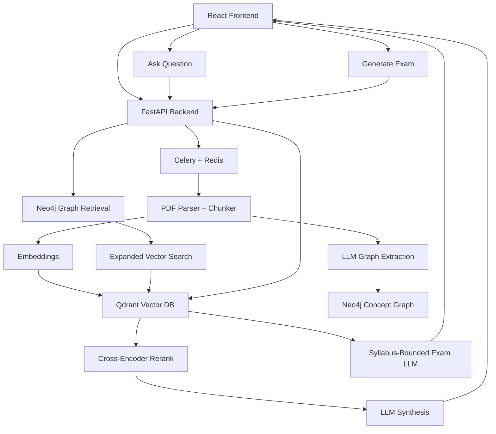

# ConceptGraph

ConceptGraph is an AI-powered academic knowledge graph and GraphRAG pipeline for dense course materials. It ingests syllabi, essays, and textbooks, isolates them by course boundary, and turns them into a searchable concept graph plus a syllabus-bounded retrieval and exam workflow.

## What It Does

- Parses PDFs asynchronously through Celery so large files do not block the API.
- Stores semantic chunks in Qdrant for vector search.
- Extracts concepts and prerequisite relationships into Neo4j.
- Uses hybrid retrieval to combine graph traversal, vector search, reranking, and LLM synthesis.
- Generates syllabus-bounded mock exams using week-level metadata.
- Renders an interactive concept map in the React dashboard.

## Architecture



## Core Features

- Multi-tenant course scoping to prevent syllabus bleed across uploads.
- Hybrid GraphRAG retrieval that expands user queries with prerequisite concepts.
- Defensive error handling with explicit HTTP responses for missing config or empty data.
- Week-level metadata tagging for syllabus-bounded exam generation.
- Apple Silicon-friendly local execution with `arm64` container images and MPS-accelerated embeddings where available.

## Tech Stack

- Frontend: React, TypeScript, Tailwind CSS, Cytoscape.js
- Backend: FastAPI, Uvicorn, Celery, Redis
- Databases: Neo4j, Qdrant, PostgreSQL
- AI/ML: PyMuPDF, LangChain, SentenceTransformers, Groq, Gemini

## Repository Layout

```text
app/
  api/
  core/
  schemas/
  services/
  tasks/
src/
  components/
  pages/
  services/
data/
docker-compose.yml
requirements.txt
package.json
```

## Getting Started

### 1. Start the infrastructure

```bash
docker compose up -d
```

This starts:

- Neo4j on `7474` and `7687`
- Qdrant on `6333`
- PostgreSQL on `5432`
- Redis on `6379`

### 2. Configure environment variables

Create a backend `.env` file with the following values:

```bash
LLM_PROVIDER=groq
GROQ_API_KEY=your_groq_api_key
GROQ_MODEL=llama-3.1-8b-instant

GEMINI_API_KEY=
GEMINI_MODEL=gemini-1.5-flash

NEO4J_URI=bolt://localhost:7687
NEO4J_USERNAME=neo4j
NEO4J_PASSWORD=conceptgraph_password

QDRANT_URL=http://localhost:6333
QDRANT_COLLECTION_NAME=conceptgraph_chunks

POSTGRES_USER=conceptgraph
POSTGRES_PASSWORD=conceptgraph_password
POSTGRES_DB=conceptgraph

REDIS_URL=redis://localhost:6379/0
```

If you are on Apple Silicon and run into fork safety issues, set:

```bash
export OBJC_DISABLE_INITIALIZE_FORK_SAFETY=YES
```

### 3. Run the backend

```bash
source venv/bin/activate
pip install -r requirements.txt
python -m uvicorn app.main:app --host 0.0.0.0 --port 8000
```

### 4. Start the Celery worker

```bash
celery -A app.tasks.document_tasks.celery_app worker --loglevel=info --pool=solo --concurrency=1
```

### 5. Run the frontend

```bash
npm install
npm run dev -- --host 127.0.0.1
```

Open the app at `http://127.0.0.1:5173`.

## Workflow

### Ingestion

1. Upload a PDF through the frontend.
2. FastAPI accepts the file and queues a Celery task.
3. The worker extracts text with PyMuPDF.
4. LangChain chunks the document.
5. Chunk embeddings are generated and stored in Qdrant.
6. The LLM extracts concepts and prerequisite relationships.
7. Neo4j stores the scoped concept graph for the course.

### Retrieval

1. The user asks a question.
2. FastAPI asks the LLM for a safe read-only Cypher query.
3. Neo4j returns the matching concept plus prerequisites.
4. Those prerequisite names expand the vector query sent to Qdrant.
5. A local cross-encoder reranks the chunks.
6. The synthesis model answers strictly from the provided context.

### Exam Generation

1. The user selects a course and week number.
2. Qdrant is filtered by `course_id` and `week`.
3. The LLM generates a syllabus-bounded mock exam.

## API Endpoints

- `POST /api/v1/ingest/upload`
- `POST /api/v1/query`
- `POST /api/v1/exam/generate`

## Notes

- The Neo4j graph is course-scoped to avoid mixing unrelated syllabi.
- `week_number` is required for syllabus-bounded exam generation.
- The project is optimized for local development on Apple Silicon.

