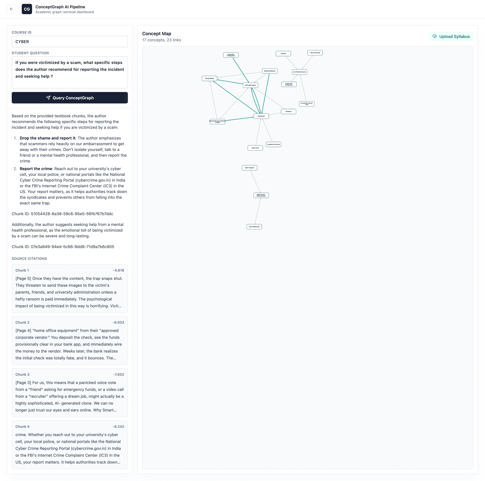
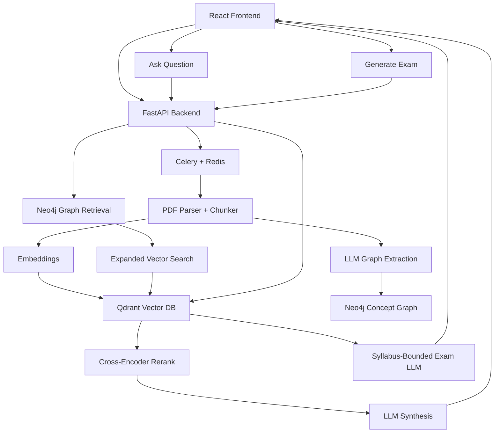

# ConceptGraph

ConceptGraph is an AI-powered academic knowledge graph and GraphRAG pipeline for dense course materials. It ingests syllabi, essays, and textbooks, isolates them by course boundary, and turns them into a searchable concept graph plus a syllabus-bounded retrieval and exam workflow.

## Preview



## What It Does

- Parses PDFs asynchronously through Celery so large files do not block the API.
- Stores semantic chunks in Qdrant for vector search.
- Extracts concepts and prerequisite relationships into Neo4j.
- Uses hybrid retrieval to combine graph traversal, vector search, reranking, and LLM synthesis.
- Generates course-wide mock exams directly from uploaded material.
- Tracks PDF ingestion status in real time through Celery-backed upload records.
- Opens source citations with page-aware PDF previews in the dashboard.
- Renders an interactive concept map in the React dashboard.
- Shows canonical course choices plus logical document, chunk, and extracted graph metrics.

## Architecture


```mermaid
flowchart TD
  A["React Frontend"] --> B["FastAPI Backend"]
  B --> C["Celery + Redis"]
  C --> D["PDF Parser + Chunker"]
  D --> E["Embeddings"]
  D --> F["LLM Graph Extraction"]
  E --> G["Qdrant Vector DB"]
  F --> H["Neo4j Concept Graph"]

  A --> I["Ask Question"]
  I --> B
  B --> J["Neo4j Graph Retrieval"]
  J --> K["Expanded Vector Search"]
  K --> G
  G --> L["Cross-Encoder Rerank"]
  L --> M["LLM Synthesis"]
  M --> A

  A --> N["Generate Exam"]
  N --> B
  B --> G
  G --> O["Syllabus-Bounded Exam LLM"]
  O --> A
```

## Core Features

- Course scoping to prevent syllabus bleed across uploads. Authentication and true tenant ownership are not implemented.
- Hybrid GraphRAG retrieval that expands user queries with prerequisite concepts.
- Defensive error handling with explicit HTTP responses for missing config or empty data.
- Simple course-level isolation across ingestion, retrieval, and exam generation.
- Apple Silicon-friendly local execution with `arm64` container images and MPS-accelerated embeddings where available.
- Graph-integrity validation for unique entities, valid relationship endpoints, and duplicate-edge removal.

## Tech Stack

- Frontend: React, TypeScript, Tailwind CSS, Cytoscape.js
- Backend: FastAPI, Uvicorn, Celery, Redis
- Databases: Neo4j, Qdrant, PostgreSQL
- AI/ML: PyMuPDF, LangChain, SentenceTransformers, Groq, Gemini

## Repository Layout

```text
app/
  api/
  core/
  schemas/
  services/
  tasks/
src/
  components/
  pages/
  services/
data/
docker-compose.yml
requirements.txt
package.json
```

## Getting Started

### 1. Start the infrastructure

```bash
docker compose up -d
```

This starts:

- Neo4j on `7474` and `7687`
- Qdrant on `6333`
- PostgreSQL on `5432`
- Redis on `6379`

### 2. Configure environment variables

Create a backend `.env` file with the following values:

```bash
LLM_PROVIDER=groq
GROQ_API_KEY=your_groq_api_key
GROQ_MODEL=llama-3.1-8b-instant

GEMINI_API_KEY=
GEMINI_MODEL=gemini-1.5-flash

NEO4J_URI=bolt://localhost:7687
NEO4J_USERNAME=neo4j
NEO4J_PASSWORD=conceptgraph_password

QDRANT_URL=http://localhost:6333
QDRANT_COLLECTION_NAME=conceptgraph_chunks

POSTGRES_USER=conceptgraph
POSTGRES_PASSWORD=conceptgraph_password
POSTGRES_DB=conceptgraph

REDIS_URL=redis://localhost:6379/0
```

If you are on Apple Silicon and run into fork safety issues, set:

```bash
export OBJC_DISABLE_INITIALIZE_FORK_SAFETY=YES
```

### 3. Run the backend

```bash
source venv/bin/activate
pip install -r requirements.txt
python -m uvicorn app.main:app --host 0.0.0.0 --port 8000
```

### 4. Start the Celery worker

```bash
celery -A app.tasks.document_tasks.celery_app worker --loglevel=info --pool=solo --concurrency=1
```

### 5. Run the frontend

```bash
npm install
npm run dev -- --host 127.0.0.1
```

Open the app at `http://127.0.0.1:5173`.

## Workflow

### Ingestion

1. Upload a PDF through the frontend.
2. FastAPI accepts the file and queues a Celery task.
3. The worker extracts text with PyMuPDF.
4. LangChain chunks the document.
5. Chunk embeddings are generated and stored in Qdrant.
6. The LLM extracts concepts and prerequisite relationships.
7. Neo4j stores the scoped concept graph for the course.

### Data Consistency

- Courses have an immutable UUID plus a normalized, case-insensitive display name. `CYBER`, `Cyber`, and `cyber ` resolve to the same course.
- PDFs are SHA-256 hashed before a document row is created. Uploading the same file to the same course returns the existing document instead of duplicating vectors or graph nodes.
- Historical same-hash rows from installations predating duplicate detection are collapsed into one logical document for course metrics and READY retrieval; the history is retained rather than deleted.
- Query and exam generation call the same READY-course resolver and filter Qdrant by READY document IDs.
- Graph nodes and relationships carry document provenance (`upload_id` and document name). Legacy graph data without provenance is excluded from query graph counts.
- Failed attempts are retained in `processing_attempts`; retries update the original document and are capped at three attempts.
- Course selection comes from `GET /api/v1/ingest/courses`, not the truncated processing queue. Courses without READY content remain visible but cannot be selected for query or exam generation.
- The dashboard remembers the course associated with a new upload, refreshes course summaries when polling observes READY, and automatically selects that course. On a fresh page load it selects the most recently updated READY course. Changing courses clears the previous answer and concept map.

| Stage | Input | Output / storage | Success condition | Failure condition |
| --- | --- | --- | --- | --- |
| Upload | PDF + course name | `courses`, `document_uploads`, stored PDF | Valid PDF, canonical course, unique course/hash document | Invalid, encrypted, oversized, or malformed PDF |
| Extract | Stored PDF | Page text in worker memory | At least one readable page | Empty/scanned PDF or missing source |
| Chunk | Page text | Typed chunks with document/page/section metadata | At least one non-empty chunk | No valid chunks |
| Embed | Chunks | Qdrant points filtered by READY document ID | Every chunk upsert completes | Vector service/model failure |
| Build graph | Representative text | Neo4j concepts/relationships with document provenance | Graph transaction completes | Provider or graph database failure |
| Commit READY | Stored counts | `document_uploads` + `processing_attempts` | All mandatory writes committed | Compensating cleanup and `FAILED` |
| Query | Course name/UUID + question | Ranked sources, answer, query subgraph | Shared READY context and usable vectors | `404` unknown course, `409` no usable READY data |
| Exam | Course name/UUID + question count | Validated questions + source count | Same READY context and usable vectors | Same `404`/`409` readiness rules as query |
| Dashboard | Upload/status/query responses | Grouped queue, citations, graph metadata | Stable typed API contract | Safe actionable error state |

### Processing States

Documents progress through durable stages:

```text
UPLOADED -> EXTRACTING -> EXTRACTED -> CHUNKING -> CHUNKED
-> EMBEDDING -> EMBEDDED -> BUILDING_GRAPH -> GRAPH_BUILT -> READY
```

Terminal states are `READY`, `FAILED`, and `CANCELLED`. A document becomes `READY` only after text extraction, chunk creation, graph construction, vector storage, and database count updates succeed. A failed attempt compensates by deleting partial vectors and provenance-scoped graph nodes.

Failure categories are `DOCUMENT_ERROR`, `CONFIGURATION_ERROR`, `PROVIDER_ERROR`, `WORKER_ERROR`, `TIMEOUT_ERROR`, `DATABASE_ERROR`, and `UNKNOWN_ERROR`. Permanent document/configuration failures cannot be retried in the dashboard. Temporary provider, worker, timeout, and database failures may be retried until the attempt limit is reached.

### Retrieval

1. The user asks a question.
2. FastAPI runs a deterministic, parameterized, read-only Cypher query scoped to READY documents.
3. Neo4j returns matching concepts and typed incoming relationships.
4. Those prerequisite names expand the vector query sent to Qdrant.
5. A local cross-encoder reranks the chunks.
6. The synthesis model answers strictly from the provided context.

Answers use readable citations such as `[Source 1]` and `[Source 2, p. 6]`. Internal chunk IDs, vector IDs, file paths, and scores are never included in model prompts or displayed answers. Source cards include the PDF name, page, detected section heading, and supporting passage.

Only `PREREQUISITE_OF` relationships expand the vector query and participate in the highlighted prerequisite path. Other relationship types remain visible with their real labels. Graph extraction rejects duplicate entity IDs and missing relationship endpoints, and collapses identical edges before persistence.

Neo4j retrieval preserves native records instead of using the driver's lossy `Result.data()` conversion, then serializes nodes and relationships through their mapping interfaces. This retains relationship endpoints, types, and provenance for the frontend.

### Exam Generation

1. The user selects a course.
2. Qdrant is filtered by `course_id`.
3. The LLM generates a syllabus-bounded mock exam.

## API Endpoints

- `POST /api/v1/ingest/upload`
- `GET /api/v1/ingest/status/{task_id}`
- `GET /api/v1/ingest/uploads`
- `GET /api/v1/ingest/courses`
- `GET /api/v1/ingest/uploads/{upload_id}/preview`
- `POST /api/v1/ingest/uploads/{upload_id}/retry`
- `DELETE /api/v1/ingest/uploads/{upload_id}` (failed records only)
- `POST /api/v1/query`
- `POST /api/v1/exam/generate`
- `GET /api/v1/health`

Query and exam responses use the same course readiness rules:

- `404`: the course does not exist.
- `409`: the course exists but has no READY documents, or READY metadata points to missing vectors.
- `200`: at least one READY document has usable indexed content.

The query response also includes graph count metadata:

```json
{
  "total_nodes": 18,
  "total_edges": 14,
  "displayed_nodes": 4,
  "displayed_edges": 2,
  "filter_reason": "query_subgraph"
}
```

These values are illustrative response fields, not hardcoded dashboard statistics; the API calculates them from the selected READY documents.

Dashboard course metrics distinguish the concepts and relationships recorded during extraction from the query-specific graph currently displayed. Historical duplicate records are shown as excluded history instead of inflating READY documents and chunk totals.

## Database Migration

Startup performs an idempotent migration for existing local installations:

- Creates `courses` and `processing_attempts`.
- Adds canonical course UUID, SHA-256 hash, stage, failure, retry, attempt, and output-count columns to `document_uploads`.
- Maps legacy `completed` rows with stored chunks to `READY`.
- Converts interrupted legacy `queued`/`running` rows to retryable `WORKER_ERROR` failures.
- Computes hashes for legacy PDFs that are still present on disk.

The migration is additive and does not delete existing PDFs. Old Neo4j nodes without document provenance are intentionally excluded from new graph totals. They must be rebuilt from a canonical PDF rather than silently attributed to a document, because doing so would invent provenance.

## Graph Display Semantics

- **READY PDFs**: unique SHA-256 document contents that completed every mandatory processing stage.
- **Chunks**: page-aware searchable passages stored as Qdrant points. They overlap slightly to preserve context.
- **Extracted nodes / edges**: concepts and relationships returned by graph extraction when the canonical document completed. These are processing-time counts, not a live Neo4j recount.
- **Showing X of Y**: the query-specific Cytoscape subgraph compared with the provenance-scoped READY graph stored in Neo4j.

Cytoscape deduplicates edges by source, target, and relationship type. It drops an edge when either endpoint is absent and highlights only incoming `PREREQUISITE_OF` chains. Isolated concepts can still be shown when independently relevant to the query.

### Legacy graph note

The current local CYBER dataset contains five historical PostgreSQL rows with one identical SHA-256 hash, so the dashboard correctly reports one logical READY PDF and excludes four duplicate records. Its older Neo4j concepts lack `upload_id` provenance and are therefore excluded from safe READY-document graph retrieval until the canonical PDF is reprocessed.

## Tests

Run backend rules and frontend production checks with:

```bash
.venv/bin/python -m unittest discover -s tests -v
npm run build
```

The backend tests cover course normalization and logical duplicate summaries, failure retryability, READY gating, citation deduplication, missing graph endpoints, and duplicate relationships.

## Notes

- The Neo4j graph is course-scoped to avoid mixing unrelated syllabi.
- A course can contain multiple PDFs; retrieval and exams use all processed PDFs in that course.
- The project is optimized for local development on Apple Silicon.
